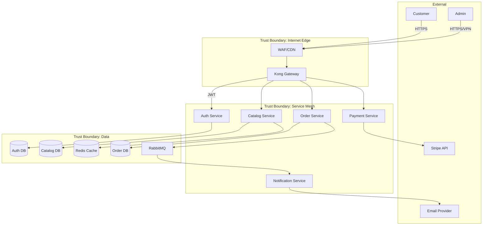
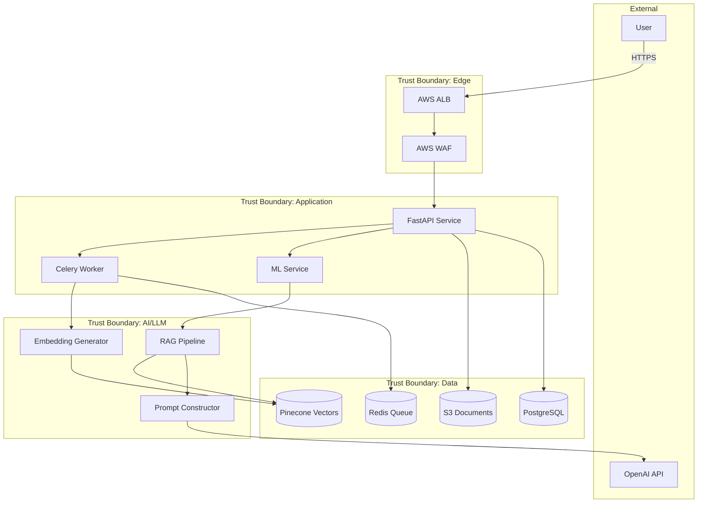
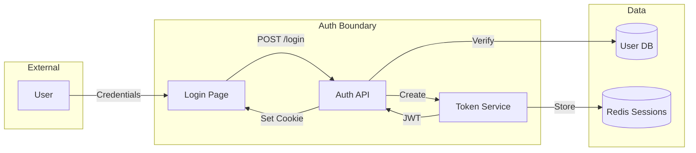
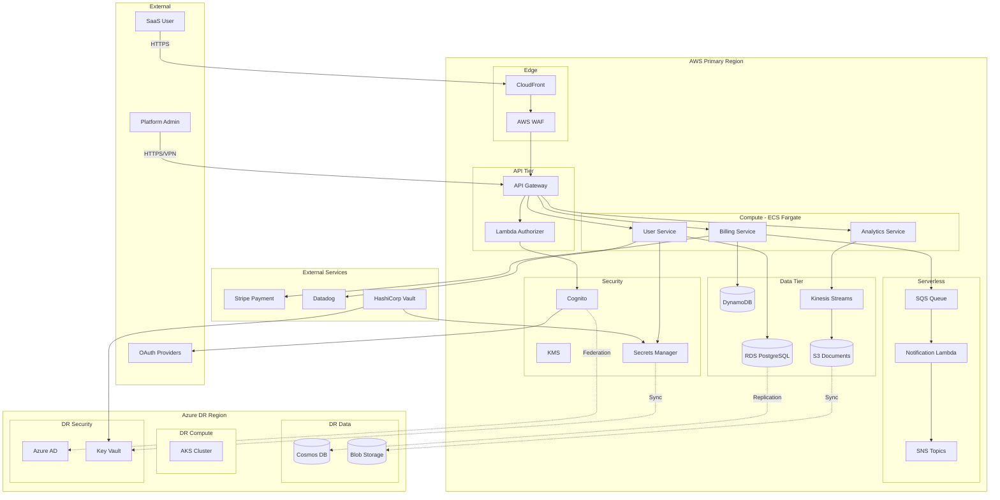

# STRIDE Threat Modeling Examples

Real-world examples demonstrating the 8-phase threat modeling workflow.

---

## KB Query Templates by Phase

> **重要**: 以下查询模板按阶段组织，确保在正确的阶段执行正确的查询，保持8阶段串行执行的严格顺序。

### Phase 5 查询模板 (STRIDE Analysis)

**用途**: 获取威胁的完整安全链上下文 (STRIDE→CWE→CAPEC→ATT&CK)

```bash
# 基础STRIDE查询
python scripts/unified_kb_query.py --stride spoofing
python scripts/unified_kb_query.py --stride tampering
python scripts/unified_kb_query.py --stride information_disclosure
python scripts/unified_kb_query.py --stride elevation_of_privilege
python scripts/unified_kb_query.py --all-stride                    # 所有类别概览
python scripts/unified_kb_query.py --element process               # 元素STRIDE适用性

# 完整安全链 (推荐用于每个识别的威胁)
python scripts/unified_kb_query.py --full-chain CWE-89             # SQL注入
python scripts/unified_kb_query.py --full-chain CWE-79             # XSS
python scripts/unified_kb_query.py --full-chain CWE-287            # 认证不当
python scripts/unified_kb_query.py --full-chain CWE-862            # 缺少授权
python scripts/unified_kb_query.py --full-chain CWE-200            # 信息暴露

# AI/LLM应用专用
python scripts/unified_kb_query.py --all-llm                       # OWASP LLM Top 10
python scripts/unified_kb_query.py --llm LLM01                     # Prompt Injection
python scripts/unified_kb_query.py --ai-component rag_retrieval    # RAG组件威胁
python scripts/unified_kb_query.py --ai-component agent_tool_executor

# 云服务威胁
python scripts/unified_kb_query.py --cloud aws --category compute
python scripts/unified_kb_query.py --cloud aws --category identity
```

### Phase 6 查询模板 (Risk Validation)

**用途**: 验证攻击路径、获取ATT&CK技术、设计POC

```bash
# CAPEC攻击模式 + ATT&CK映射
python scripts/unified_kb_query.py --capec CAPEC-66 --attack-chain   # SQL注入攻击链
python scripts/unified_kb_query.py --capec CAPEC-86 --attack-chain   # XSS攻击链
python scripts/unified_kb_query.py --capec CAPEC-122 --attack-chain  # 权限滥用
python scripts/unified_kb_query.py --capec CAPEC-586 --attack-chain  # 反序列化

# ATT&CK技术详情
python scripts/unified_kb_query.py --attack-technique T1059         # 命令解释器
python scripts/unified_kb_query.py --attack-technique T1078         # 有效账户滥用
python scripts/unified_kb_query.py --attack-technique T1195         # 供应链攻击
python scripts/unified_kb_query.py --attack-technique T1610         # 容器部署
python scripts/unified_kb_query.py --attack-technique T1611         # 容器逃逸
python scripts/unified_kb_query.py --attack-search "command line"   # ATT&CK搜索

# KEV已知利用漏洞检查
python scripts/unified_kb_query.py --check-kev CVE-2021-44228       # Log4Shell
python scripts/unified_kb_query.py --check-kev CVE-2023-44487       # HTTP/2 Rapid Reset

# CVE验证
python scripts/unified_kb_query.py --cve-for-cwe CWE-89 --cve-severity CRITICAL
python scripts/unified_kb_query.py --cve-search "deserialization" --cve-severity CRITICAL
python scripts/unified_kb_query.py --stride-cve T                   # Tampering相关CVE
```

### Phase 6+ 验证测试查询 (v2.0 Verification Set)

**用途**: 获取STRIDE威胁对应的验证测试程序（WSTG/MASTG/ASVS）

```bash
# STRIDE→验证测试映射 (1,269 total mappings)
python scripts/unified_kb_query.py --stride-tests S                  # Spoofing: 240 tests
python scripts/unified_kb_query.py --stride-tests T                  # Tampering: 402 tests
python scripts/unified_kb_query.py --stride-tests I                  # Info Disclosure: 442 tests
python scripts/unified_kb_query.py --stride-tests E                  # Elevation: 90 tests

# CWE→验证测试映射
python scripts/unified_kb_query.py --cwe-tests CWE-89               # SQL注入验证测试
python scripts/unified_kb_query.py --cwe-tests CWE-79               # XSS验证测试
python scripts/unified_kb_query.py --cwe-tests CWE-287              # 认证验证测试

# WSTG按类别查询 (121 tests)
python scripts/unified_kb_query.py --wstg-category ATHN             # 认证测试
python scripts/unified_kb_query.py --wstg-category INPV             # 输入验证测试
python scripts/unified_kb_query.py --wstg-category SESS             # 会话管理测试
python scripts/unified_kb_query.py --wstg-category AUTHZ            # 授权测试

# MASTG按平台查询 (206 tests)
python scripts/unified_kb_query.py --mastg-platform android         # Android安全测试
python scripts/unified_kb_query.py --mastg-platform ios             # iOS安全测试

# ASVS按级别查询 (345 requirements)
python scripts/unified_kb_query.py --asvs-level L1                  # Level 1 基础要求
python scripts/unified_kb_query.py --asvs-level L2                  # Level 2 标准要求
python scripts/unified_kb_query.py --asvs-level L3                  # Level 3 高级要求

# ASVS按章节查询
python scripts/unified_kb_query.py --asvs-chapter V2                # 认证验证
python scripts/unified_kb_query.py --asvs-chapter V4                # 访问控制
python scripts/unified_kb_query.py --asvs-chapter V5                # 输入验证

# 验证集统计
python scripts/unified_kb_query.py --verification-stats             # 全部统计
```

### Phase 7 查询模板 (Mitigation)

**用途**: 获取CWE消减措施、ATT&CK消减、CVE上下文

```bash
# CWE消减措施
python scripts/unified_kb_query.py --cwe CWE-89 --mitigations       # SQL注入消减
python scripts/unified_kb_query.py --cwe CWE-79 --mitigations       # XSS消减
python scripts/unified_kb_query.py --cwe CWE-287 --mitigations      # 认证消减
python scripts/unified_kb_query.py --cwe CWE-502 --mitigations      # 反序列化消减
python scripts/unified_kb_query.py --cwe CWE-327 --mitigations      # 加密算法消减

# ATT&CK消减措施
python scripts/unified_kb_query.py --attack-mitigation M1049        # 杀软/反恶意软件
python scripts/unified_kb_query.py --attack-mitigation M1038        # 执行阻止
python scripts/unified_kb_query.py --attack-mitigation M1026        # 特权账户管理

# CVE上下文 (了解实际漏洞案例)
python scripts/unified_kb_query.py --cve-for-cwe CWE-89             # SQL注入相关CVE
python scripts/unified_kb_query.py --cve CVE-2021-44228             # 直接查询CVE详情

# 语义搜索消减建议
python scripts/unified_kb_query.py --semantic-search "authentication bypass mitigation" --search-type cwe
python scripts/unified_kb_query.py --semantic-search "SQL injection prevention"
```

---

## 按威胁类型的完整8阶段查询示例

### 示例A: SQL注入威胁的完整分析链

```bash
# Phase 5: STRIDE Analysis
python scripts/unified_kb_query.py --full-chain CWE-89
# 输出: STRIDE映射、CWE详情、关联CAPEC、消减概览

# Phase 6: Risk Validation
python scripts/unified_kb_query.py --capec CAPEC-66 --attack-chain
python scripts/unified_kb_query.py --attack-technique T1190
python scripts/unified_kb_query.py --cve-for-cwe CWE-89 --cve-severity CRITICAL
# 输出: 攻击路径、ATT&CK技术、高危CVE案例

# Phase 7: Mitigation
python scripts/unified_kb_query.py --cwe CWE-89 --mitigations
# 输出: 详细消减措施 (参数化查询、输入验证、最小权限等)
```

### 示例B: AI/LLM应用的完整分析链

```bash
# Phase 5: STRIDE Analysis
python scripts/unified_kb_query.py --all-llm
python scripts/unified_kb_query.py --llm LLM01                     # Prompt Injection
python scripts/unified_kb_query.py --ai-component rag_retrieval

# Phase 6: Risk Validation
python scripts/unified_kb_query.py --semantic-search "prompt injection attack" --search-type capec
python scripts/unified_kb_query.py --cve-search "LLM" --cve-severity HIGH

# Phase 7: Mitigation
python scripts/unified_kb_query.py --semantic-search "prompt injection prevention"
python scripts/unified_kb_query.py --cwe CWE-94 --mitigations      # 代码注入消减
```

### 示例C: 认证授权缺陷的完整分析链

```bash
# Phase 5: STRIDE Analysis
python scripts/unified_kb_query.py --stride spoofing
python scripts/unified_kb_query.py --stride elevation_of_privilege
python scripts/unified_kb_query.py --full-chain CWE-287            # 认证不当
python scripts/unified_kb_query.py --full-chain CWE-862            # 缺少授权

# Phase 6: Risk Validation
python scripts/unified_kb_query.py --capec CAPEC-122 --attack-chain # 权限滥用
python scripts/unified_kb_query.py --attack-technique T1078         # 有效账户
python scripts/unified_kb_query.py --check-kev CVE-2023-22515       # Confluence漏洞

# Phase 7: Mitigation
python scripts/unified_kb_query.py --cwe CWE-287 --mitigations
python scripts/unified_kb_query.py --cwe CWE-862 --mitigations
python scripts/unified_kb_query.py --attack-mitigation M1026        # 特权账户管理
```

---

---

## Example 1: REST API Backend (Quick Assessment)

**Scenario**: User requests a quick security check on a Node.js Express API.

### User Request
```
"Do a quick security review of this API project"
```

### Phase 1: Project Understanding

```bash
$ python scripts/list_files.py ./express-api --categorize --detect-type --pretty
```

```json
{
  "project_type": {
    "primary_type": "javascript",
    "detected_types": [
      {"type": "javascript", "confidence_score": 45},
      {"type": "docker", "confidence_score": 10}
    ]
  },
  "categories": {
    "entry_points": {"files": ["src/index.js", "src/app.js"]},
    "api_routes": {"files": ["src/routes/users.js", "src/routes/auth.js"]},
    "config": {"files": ["config/database.js", ".env.example"]}
  }
}
```

**Key Findings**:
- Express.js REST API
- JWT authentication
- PostgreSQL database
- Docker deployment

### Phase 5: STRIDE Analysis (Quick)

```bash
$ python scripts/stride_matrix.py --element process --pretty
$ python scripts/query_kb.py --stride spoofing --pretty
```

**Identified Threats**:

| ID | Category | Element | Threat | Priority |
|----|----------|---------|--------|----------|
| T-S-P1-001 | Spoofing | Auth Controller | JWT secret in environment variable | Medium |
| T-T-DF1-001 | Tampering | User Input | No input validation on /users endpoint | High |
| T-I-DS1-001 | Info Disclosure | Error Handler | Stack traces exposed in production | Medium |
| T-E-P2-001 | Elevation | Users Controller | Missing authorization check on DELETE | Critical |

### Quick Report Output

```markdown
## Quick Security Assessment: express-api

**Threats Found**: 4 (1 Critical, 1 High, 2 Medium)

### Critical Finding
**T-E-P2-001**: DELETE /users/:id lacks authorization check.
Any authenticated user can delete other users.

**Immediate Action**: Add ownership verification before delete operation.

### High Priority
**T-T-DF1-001**: User input not validated.
Missing schema validation on POST /users endpoint.

**Fix**: Implement Joi or Zod validation middleware.
```

---

## Example 2: E-Commerce Microservices (Standard Assessment)

**Scenario**: Full threat model for an e-commerce platform with microservices architecture.

### User Request
```
"Create a threat model for this e-commerce microservices system"
```

### Phase 1: Project Understanding

**Architecture Identified**:
```
ecommerce-platform/
├── gateway-service/        # API Gateway (Kong)
├── auth-service/           # Authentication (OAuth2)
├── catalog-service/        # Product catalog
├── order-service/          # Order processing
├── payment-service/        # Payment integration (Stripe)
├── notification-service/   # Email/SMS notifications
├── kubernetes/             # K8s deployment configs
└── docker-compose.yml      # Local development
```

**Technology Stack**:
- Gateway: Kong API Gateway
- Services: Go microservices
- Database: PostgreSQL (per-service)
- Cache: Redis
- Queue: RabbitMQ
- Deployment: Kubernetes

### Phase 2: DFD



### Phase 3: Trust Boundaries

| Boundary | Components | Protection |
|----------|------------|------------|
| Internet Edge | WAF, CDN | DDoS protection, TLS termination |
| Gateway | Kong | Rate limiting, JWT validation |
| Service Mesh | All services | mTLS, service accounts |
| Data Tier | Databases, Redis | Network isolation, encryption |

**Cross-Boundary Flows (High Risk)**:
- Customer → Kong (Internet to Gateway)
- Kong → Services (Gateway to internal)
- Payment → Stripe (Internal to external)

### Phase 4: Security Design

| Control | Auth | Catalog | Order | Payment |
|---------|------|---------|-------|---------|
| Authentication | OAuth2 | JWT | JWT | JWT |
| Authorization | RBAC | Read-only | Ownership | Admin only |
| Input Validation | Yes | Partial | Yes | Yes |
| Encryption (transit) | mTLS | mTLS | mTLS | mTLS |
| Encryption (rest) | Yes | No | Yes | Yes |
| Rate Limiting | Yes | No | Yes | Yes |
| Audit Logging | Yes | No | Yes | Yes |

**Gaps Identified**:
1. Catalog service lacks encryption at rest
2. No rate limiting on catalog queries
3. Missing audit logs for catalog changes

### Phase 5: STRIDE Analysis

```bash
$ python scripts/stride_matrix.py --interaction external_interactor process --pretty
$ python scripts/query_kb.py --stride information_disclosure --pretty
```

**Threat Inventory**:

| ID | STRIDE | Element | Threat | CWE | Priority |
|----|--------|---------|--------|-----|----------|
| T-S-P1-001 | S | Kong Gateway | OAuth token theft via XSS | CWE-79 | High |
| T-S-P2-001 | S | Auth Service | Brute force login | CWE-307 | Medium |
| T-T-DF1-001 | T | Order Input | Order amount manipulation | CWE-20 | Critical |
| T-T-DF2-001 | T | Payment Callback | Webhook tampering | CWE-345 | High |
| T-R-P3-001 | R | Order Service | Missing order audit trail | CWE-778 | Medium |
| T-I-DS1-001 | I | Catalog DB | Product data not encrypted | CWE-311 | Low |
| T-I-DF3-001 | I | Payment Flow | Card data in logs | CWE-532 | Critical |
| T-D-P1-001 | D | Kong Gateway | API rate limit bypass | CWE-400 | Medium |
| T-D-P4-001 | D | Catalog Service | Query complexity attack | CWE-400 | Medium |
| T-E-P5-001 | E | Order Service | IDOR on order retrieval | CWE-639 | High |
| T-E-P2-002 | E | Auth Service | Role escalation via JWT | CWE-269 | High |

### Phase 6: Mitigations

**Critical Priority**:

| Threat | Mitigation | Implementation |
|--------|------------|----------------|
| T-T-DF1-001 | Server-side price validation | Compare order amounts against catalog DB |
| T-I-DF3-001 | PII data masking | Implement log sanitization middleware |

**High Priority**:

| Threat | Mitigation | Implementation |
|--------|------------|----------------|
| T-S-P1-001 | CSP headers | Add Content-Security-Policy to responses |
| T-T-DF2-001 | Webhook signature | Verify Stripe signature on callbacks |
| T-E-P5-001 | Ownership check | Query orders WHERE user_id = current_user |
| T-E-P2-002 | JWT claim validation | Validate role claims server-side |

---

## Example 3: AI/LLM Application (Full Assessment)

**Scenario**: Comprehensive threat model for an AI-powered document analysis platform.

### User Request
```
"I need a full security assessment with compliance mapping for our AI document platform"
```

### Phase 1: Project Understanding

**Architecture**:
```
ai-doc-platform/
├── api/                    # FastAPI backend
│   ├── routes/
│   ├── services/
│   │   ├── llm_service.py  # OpenAI integration
│   │   └── doc_parser.py   # Document processing
│   └── models/
├── frontend/               # React SPA
├── workers/                # Celery async tasks
├── ml/                     # ML model serving
│   └── embeddings/         # Vector embeddings
└── infra/                  # Terraform (AWS)
```

**Technology Stack**:
- Backend: FastAPI (Python)
- Frontend: React
- LLM: OpenAI GPT-4 API
- Vector DB: Pinecone
- Storage: AWS S3
- Queue: Redis + Celery
- Deployment: AWS ECS

**AI/LLM Components**:
- Document ingestion and parsing
- Text embedding generation
- RAG (Retrieval Augmented Generation)
- LLM-powered summarization

### Phase 2: DFD with AI Components



### Phase 3: Trust Boundaries (AI-Specific)

| Boundary | Components | AI-Specific Concerns |
|----------|------------|---------------------|
| Edge | ALB, WAF | Prompt injection in input |
| Application | API, Workers | User content handling |
| **AI/LLM** | Embedder, RAG, Prompt | Model input/output security |
| Data | S3, Pinecone, DB | Training data, embeddings |
| External AI | OpenAI API | Data sent to third-party |

### Phase 4: Security Design (AI Focus)

| Control | Standard | AI-Specific |
|---------|----------|-------------|
| Input Validation | Schema validation | Prompt injection filtering |
| Output Handling | XSS prevention | LLM output sanitization |
| Data Protection | Encryption | Embedding privacy |
| Access Control | RBAC | Document-level permissions |
| Logging | Audit trails | Prompt/response logging |
| Rate Limiting | API throttling | Token usage limits |

**AI/LLM Security Gaps**:
1. No prompt injection detection
2. LLM responses not sanitized
3. Document embeddings not isolated per-tenant
4. API keys in environment variables
5. No output content filtering

### Phase 5: STRIDE + OWASP LLM Top 10

**Standard STRIDE Threats**:

| ID | STRIDE | Element | Threat | Priority |
|----|--------|---------|--------|----------|
| T-S-P1-001 | S | API | JWT token leakage | High |
| T-T-DF1-001 | T | Document Upload | Malicious file upload | High |
| T-I-DS1-001 | I | S3 | Document access without auth | Critical |

**LLM-Specific Threats (OWASP LLM Top 10)**:

| ID | OWASP LLM | Element | Threat | Priority |
|----|-----------|---------|--------|----------|
| T-LLM-01 | LLM01 | Prompt Constructor | Prompt injection via document | Critical |
| T-LLM-02 | LLM02 | RAG Pipeline | Insecure output handling | High |
| T-LLM-03 | LLM03 | Worker | Training data poisoning | Medium |
| T-LLM-04 | LLM04 | MLService | Model denial of service | Medium |
| T-LLM-05 | LLM05 | Pinecone | Supply chain (embedding model) | Low |
| T-LLM-06 | LLM06 | API | Sensitive info disclosure in response | High |
| T-LLM-07 | LLM07 | Prompt | Insecure plugin design | Medium |
| T-LLM-08 | LLM08 | RAG | Excessive agency | High |
| T-LLM-09 | LLM09 | API | Overreliance on LLM | Medium |
| T-LLM-10 | LLM10 | MLService | Model theft | Low |

### Phase 6: AI-Specific Mitigations

**Prompt Injection Defense**:
```python
# Input sanitization before LLM
def sanitize_prompt_input(user_input: str) -> str:
    # Remove common injection patterns
    patterns = [
        r"ignore previous instructions",
        r"system:",
        r"<\|.*\|>",
        r"```.*```",
    ]
    sanitized = user_input
    for pattern in patterns:
        sanitized = re.sub(pattern, "", sanitized, flags=re.IGNORECASE)
    return sanitized

# Output validation after LLM
def validate_llm_output(response: str, allowed_actions: List[str]) -> str:
    # Check for unauthorized actions
    if any(action in response.lower() for action in BLOCKED_ACTIONS):
        raise SecurityException("LLM attempted unauthorized action")
    return response
```

**Tenant Isolation for Embeddings**:
```python
# Pinecone namespace isolation
def query_embeddings(user_id: str, query_vector: List[float]):
    return pinecone_index.query(
        vector=query_vector,
        namespace=f"tenant_{user_id}",  # Tenant isolation
        top_k=10,
        filter={"access_level": {"$lte": user.access_level}}
    )
```

### Phase 7: Report with Compliance

**Executive Summary**:
- 21 threats identified (3 Critical, 8 High, 7 Medium, 3 Low)
- 6 AI/LLM-specific vulnerabilities
- Immediate action required for prompt injection defense

**Compliance Mapping**:

| Framework | Requirement | Current Status | Gap |
|-----------|-------------|----------------|-----|
| SOC 2 | Access Control | Partial | Tenant isolation needed |
| GDPR | Data Processing | Partial | Consent for AI processing |
| OWASP LLM | Prompt Security | Missing | No injection defense |
| AI Act (EU) | Transparency | Partial | No explanation logging |

---

## Example 4: Minimal Web App (Targeted Analysis)

**Scenario**: User wants to analyze specific components only.

### User Request
```
"Focus on the authentication flow only"
```

### Targeted DFD



### Focused STRIDE on Auth Flow

| ID | Threat | Attack Scenario | Mitigation |
|----|--------|-----------------|------------|
| T-S-AUTH-001 | Credential stuffing | Attacker uses leaked credentials | Rate limiting, MFA |
| T-S-AUTH-002 | Session hijacking | Steal JWT from XSS | httpOnly cookies, CSP |
| T-T-AUTH-001 | JWT manipulation | Modify claims in token | HMAC signature verification |
| T-R-AUTH-001 | Login repudiation | User denies login | IP + timestamp logging |
| T-I-AUTH-001 | Password disclosure | Weak hashing | Argon2id with cost 12 |
| T-D-AUTH-001 | Auth endpoint DoS | Flood /login | Captcha, rate limit |
| T-E-AUTH-001 | Role escalation | Modify role claim | Server-side role lookup |

---

## Script Usage Examples

### Getting Started
```bash
# Understand project structure
python scripts/list_files.py ./my-project --categorize --detect-type --pretty

# Get STRIDE matrix for element types
python scripts/stride_matrix.py --show-matrix --pretty

# Query specific STRIDE category
python scripts/query_kb.py --stride spoofing --pretty

# Query specific CWE
python scripts/query_kb.py --cwe 89 --pretty

# Generate threat ID
python scripts/stride_matrix.py --generate-id T P1 001
# Output: {"threat_id": "T-T-P1-001", ...}
```

### Integration Example
```bash
# Phase 1: Understand
python scripts/list_files.py ./project --categorize --detect-type > phase1.json

# Phase 5: STRIDE for all elements
for elem in process data_store data_flow; do
    python scripts/stride_matrix.py --element $elem >> stride_output.json
done

# Phase 5: Get CWE mappings for identified threats
python scripts/query_kb.py --stride tampering --pretty
python scripts/query_kb.py --cwe 89 --pretty  # SQL Injection
python scripts/query_kb.py --cwe 79 --pretty  # XSS
```

---

## Output Format Examples

### Threat Card Format
```markdown
### T-S-P1-001: API Gateway Authentication Bypass

**Category**: Spoofing
**Element**: API Gateway (P1)
**Priority**: High
**Status**: Open

**Description**:
Attacker can bypass JWT validation by manipulating the algorithm header.

**Attack Scenario**:
1. Attacker intercepts valid JWT
2. Changes algorithm to "none"
3. Removes signature
4. Server accepts modified token

**Impact**:
- Full authentication bypass
- Access to any user account
- Admin privilege escalation possible

**CWE**: CWE-347 (Improper Verification of Cryptographic Signature)
**CAPEC**: CAPEC-115 (Authentication Bypass)

**Mitigation**:
- Enforce algorithm in verification: `jwt.verify(token, secret, {algorithms: ['HS256']})`
- Reject tokens without signatures
- Use RS256 with key pair

**References**:
- assets/knowledge/security-controls/auth-patterns-reference.md
- codeguard-0-authentication-mfa.md
```

### DFD Element Annotation
```markdown
## Element: Auth Service (P2)

**Type**: Process
**Applicable STRIDE**: S, T, R, I, D, E (all)

**Properties**:
- Authenticates: Yes (primary auth provider)
- Implements Authorization: Yes (RBAC)
- Input Validation: Partial
- Logging: Yes (audit trail)

**Connected Flows**:
- Inbound: DF1 (from Gateway), DF3 (from Admin Console)
- Outbound: DF2 (to User DB), DF4 (to Session Store)

**Trust Boundaries Crossed**:
- Gateway → Auth Service (medium trust)
- Auth Service → User DB (high trust)
```

---

## Example 5: Multi-Cloud SaaS Platform (Cloud-Native Assessment)

**Scenario**: Enterprise SaaS platform with multi-cloud deployment, requiring cloud-specific threat analysis and compliance mapping.

### User Request
```
"Perform a cloud security assessment for our SaaS platform deployed on AWS primary with Azure DR"
```

### Phase 1: Project Understanding

```bash
$ python scripts/list_files.py ./saas-platform --categorize --detect-type --pretty
```

**Architecture Identified**:
```
saas-platform/
├── services/
│   ├── api-gateway/           # AWS API Gateway + Lambda Authorizer
│   ├── user-service/          # ECS Fargate
│   ├── billing-service/       # ECS Fargate
│   ├── analytics-service/     # ECS Fargate + Kinesis
│   └── notification-service/  # Lambda + SQS
├── infrastructure/
│   ├── aws/
│   │   ├── vpc.tf
│   │   ├── ecs.tf
│   │   ├── rds.tf
│   │   ├── s3.tf
│   │   ├── cognito.tf
│   │   └── kms.tf
│   ├── azure/                 # DR Region
│   │   ├── aks.tf
│   │   ├── cosmos-db.tf
│   │   └── key-vault.tf
│   └── shared/
│       ├── monitoring.tf      # Datadog integration
│       └── secrets.tf         # HashiCorp Vault
└── pipelines/
    └── github-actions/
```

**Cloud Services Inventory**:

| Category | AWS Primary | Azure DR |
|----------|-------------|----------|
| **Compute** | ECS Fargate, Lambda | AKS |
| **Database** | RDS PostgreSQL, DynamoDB | Cosmos DB |
| **Storage** | S3, EFS | Blob Storage |
| **Identity** | Cognito, IAM | Azure AD |
| **Networking** | VPC, ALB, CloudFront | VNet, Azure CDN |
| **Security** | KMS, Secrets Manager, WAF | Key Vault, Defender |
| **Messaging** | SQS, SNS, EventBridge | Service Bus |
| **Monitoring** | CloudWatch, X-Ray | Azure Monitor |

### Phase 2: Multi-Cloud DFD



### Phase 3: Cloud Trust Boundaries

| Boundary | Scope | Cloud Services | Cross-Cloud Concerns |
|----------|-------|----------------|---------------------|
| **Internet Edge** | CDN, WAF | CloudFront, AWS WAF | DDoS, Bot protection |
| **API Gateway** | Request routing | API Gateway, Lambda Auth | API key rotation |
| **VPC Network** | Private subnets | VPC, Security Groups | VPC peering security |
| **Container** | Fargate tasks | ECS, ECR | Image vulnerabilities |
| **Data Encryption** | At-rest/transit | KMS, S3 encryption | Key synchronization |
| **Cross-Cloud** | AWS ↔ Azure | Transit Gateway, ExpressRoute | Data residency |
| **Identity Federation** | User auth | Cognito ↔ Azure AD | Token trust chain |
| **External SaaS** | Third-party | Stripe, Datadog | API credential exposure |

**Critical Cross-Boundary Flows**:
1. **User → CloudFront → API Gateway** (Internet to application)
2. **Lambda Authorizer → Cognito** (Auth decision)
3. **ECS → RDS** (Application to data)
4. **RDS → Cosmos DB** (Cross-cloud replication)
5. **Billing → Stripe** (Internal to external payment)

### Phase 4: Cloud Security Design

**AWS Security Controls**:

| Service | Authentication | Encryption (Transit) | Encryption (Rest) | Logging |
|---------|---------------|---------------------|-------------------|---------|
| API Gateway | Cognito JWT | TLS 1.2+ | N/A | CloudWatch |
| ECS Fargate | IAM Task Role | TLS 1.2+ | EFS Encrypted | X-Ray |
| RDS PostgreSQL | IAM Auth | TLS + pg SSL | KMS | CloudTrail |
| DynamoDB | IAM Policy | HTTPS | KMS | CloudTrail |
| S3 | IAM + Bucket Policy | TLS | SSE-KMS | S3 Access Logs |
| Lambda | IAM Execution Role | TLS | Env Encryption | CloudWatch |
| Secrets Manager | IAM + Resource Policy | TLS | KMS | CloudTrail |

**Azure DR Security Controls**:

| Service | Authentication | Encryption (Transit) | Encryption (Rest) | Logging |
|---------|---------------|---------------------|-------------------|---------|
| AKS | Azure AD + RBAC | TLS 1.2+ | Azure Disk Encryption | Azure Monitor |
| Cosmos DB | Azure AD + Keys | TLS 1.2 | Service Managed | Diagnostic Logs |
| Blob Storage | Azure AD + SAS | HTTPS | Storage Service Encryption | Storage Analytics |
| Key Vault | Azure AD + RBAC | TLS | HSM | Audit Logs |

**Security Gaps Identified**:
1. ⚠️ Cross-cloud key management not unified (KMS vs Key Vault)
2. ⚠️ Cognito-Azure AD federation lacks MFA requirement
3. ⚠️ S3 bucket policies not reviewed recently
4. ⚠️ ECS task roles overly permissive
5. ⚠️ No WAF rules for Azure CDN in DR
6. ⚠️ Kinesis stream not encrypted

### Phase 5: Cloud-Specific STRIDE Analysis

```bash
# Query cloud service threats
$ python scripts/query_kb.py --cloud aws --category compute --pretty
$ python scripts/query_kb.py --cloud azure --category identity --pretty
$ python scripts/stride_matrix.py --element process --cloud-context --pretty
```

**AWS-Specific Threats**:

| ID | STRIDE | Service | Threat | CWE | Priority |
|----|--------|---------|--------|-----|----------|
| CLOUD-S-AWS-001 | S | Cognito | Cognito user pool enumeration | CWE-203 | Medium |
| CLOUD-S-AWS-002 | S | IAM | Overprivileged Lambda execution role | CWE-250 | High |
| CLOUD-T-AWS-001 | T | S3 | Object tampering via misconfigured bucket policy | CWE-732 | High |
| CLOUD-T-AWS-002 | T | API Gateway | Request/response manipulation (no signing) | CWE-345 | Medium |
| CLOUD-R-AWS-001 | R | CloudTrail | Insufficient CloudTrail coverage | CWE-778 | Medium |
| CLOUD-I-AWS-001 | I | RDS | Snapshot sharing exposes data | CWE-200 | Critical |
| CLOUD-I-AWS-002 | I | CloudWatch | Sensitive data in log groups | CWE-532 | High |
| CLOUD-I-AWS-003 | I | Kinesis | Unencrypted stream data | CWE-311 | High |
| CLOUD-D-AWS-001 | D | Lambda | Concurrent execution exhaustion | CWE-400 | Medium |
| CLOUD-D-AWS-002 | D | DynamoDB | Provisioned capacity exhaustion | CWE-400 | Medium |
| CLOUD-E-AWS-001 | E | IAM | IAM role assumption chain attack | CWE-269 | High |
| CLOUD-E-AWS-002 | E | ECS | Container escape to host | CWE-250 | Critical |

**Azure DR-Specific Threats**:

| ID | STRIDE | Service | Threat | CWE | Priority |
|----|--------|---------|--------|-----|----------|
| CLOUD-S-AZ-001 | S | Azure AD | Stale service principal credentials | CWE-798 | High |
| CLOUD-T-AZ-001 | T | Cosmos DB | Cross-partition data tampering | CWE-284 | Medium |
| CLOUD-I-AZ-001 | I | Key Vault | Soft-deleted secrets recoverable | CWE-200 | Medium |
| CLOUD-I-AZ-002 | I | Blob Storage | Overly permissive SAS tokens | CWE-732 | High |
| CLOUD-D-AZ-001 | D | AKS | Pod resource exhaustion | CWE-400 | Medium |
| CLOUD-E-AZ-001 | E | Azure AD | Conditional Access bypass | CWE-863 | High |

**Cross-Cloud Threats**:

| ID | STRIDE | Flow | Threat | Priority |
|----|--------|------|--------|----------|
| CLOUD-CROSS-001 | I | RDS → Cosmos DB | Replication exposes data in transit | High |
| CLOUD-CROSS-002 | T | Secrets sync | Key material divergence | Medium |
| CLOUD-CROSS-003 | S | Identity federation | Token replay across clouds | High |
| CLOUD-CROSS-004 | D | DR failover | Asymmetric capacity causes partial outage | Medium |

### Phase 6: Cloud-Native Mitigations

**AWS Mitigations**:

```hcl
# IAM least privilege for Lambda
resource "aws_iam_role" "lambda_auth_role" {
  name = "lambda-auth-role"

  assume_role_policy = jsonencode({
    Version = "2012-10-17"
    Statement = [{
      Action = "sts:AssumeRole"
      Effect = "Allow"
      Principal = {
        Service = "lambda.amazonaws.com"
      }
      Condition = {
        StringEquals = {
          "aws:SourceAccount" = data.aws_caller_identity.current.account_id
        }
      }
    }]
  })
}

# Scoped permissions - read-only to Cognito
resource "aws_iam_role_policy" "lambda_auth_policy" {
  name = "lambda-auth-policy"
  role = aws_iam_role.lambda_auth_role.id

  policy = jsonencode({
    Version = "2012-10-17"
    Statement = [
      {
        Effect = "Allow"
        Action = [
          "cognito-idp:GetUser",
          "cognito-idp:AdminGetUser"
        ]
        Resource = aws_cognito_user_pool.main.arn
      },
      {
        Effect = "Allow"
        Action = [
          "logs:CreateLogGroup",
          "logs:CreateLogStream",
          "logs:PutLogEvents"
        ]
        Resource = "arn:aws:logs:*:*:log-group:/aws/lambda/${var.function_name}:*"
      }
    ]
  })
}
```

```hcl
# S3 bucket security hardening
resource "aws_s3_bucket" "documents" {
  bucket = "${var.project}-documents-${var.environment}"
}

resource "aws_s3_bucket_server_side_encryption_configuration" "documents" {
  bucket = aws_s3_bucket.documents.id

  rule {
    apply_server_side_encryption_by_default {
      kms_master_key_id = aws_kms_key.documents.arn
      sse_algorithm     = "aws:kms"
    }
    bucket_key_enabled = true
  }
}

resource "aws_s3_bucket_public_access_block" "documents" {
  bucket = aws_s3_bucket.documents.id

  block_public_acls       = true
  block_public_policy     = true
  ignore_public_acls      = true
  restrict_public_buckets = true
}

resource "aws_s3_bucket_versioning" "documents" {
  bucket = aws_s3_bucket.documents.id
  versioning_configuration {
    status = "Enabled"
  }
}
```

```hcl
# Kinesis stream encryption
resource "aws_kinesis_stream" "analytics" {
  name             = "${var.project}-analytics-stream"
  shard_count      = 2
  retention_period = 24

  encryption_type = "KMS"
  kms_key_id      = aws_kms_key.kinesis.arn

  stream_mode_details {
    stream_mode = "ON_DEMAND"
  }
}
```

**Azure DR Mitigations**:

```hcl
# Azure Key Vault with purge protection
resource "azurerm_key_vault" "dr" {
  name                        = "${var.project}-kv-dr"
  location                    = azurerm_resource_group.dr.location
  resource_group_name         = azurerm_resource_group.dr.name
  tenant_id                   = data.azurerm_client_config.current.tenant_id
  sku_name                    = "premium"  # HSM-backed

  enabled_for_disk_encryption = true
  soft_delete_retention_days  = 90
  purge_protection_enabled    = true

  network_acls {
    default_action             = "Deny"
    bypass                     = "AzureServices"
    virtual_network_subnet_ids = [azurerm_subnet.aks.id]
    ip_rules                   = var.allowed_ips
  }
}

# Restrict access to managed identity
resource "azurerm_key_vault_access_policy" "aks" {
  key_vault_id = azurerm_key_vault.dr.id
  tenant_id    = data.azurerm_client_config.current.tenant_id
  object_id    = azurerm_kubernetes_cluster.dr.kubelet_identity[0].object_id

  secret_permissions = ["Get", "List"]
  key_permissions    = ["Get", "List", "Decrypt"]
}
```

**Cross-Cloud Security**:

```hcl
# Cross-cloud replication encryption
resource "aws_dms_replication_instance" "cross_cloud" {
  replication_instance_id     = "aws-to-azure-replication"
  replication_instance_class  = "dms.t3.medium"
  allocated_storage          = 50

  kms_key_arn                = aws_kms_key.dms.arn
  publicly_accessible        = false
  vpc_security_group_ids     = [aws_security_group.dms.id]
  replication_subnet_group_id = aws_dms_replication_subnet_group.main.id
}

# Use private connectivity (AWS PrivateLink / Azure Private Link)
resource "aws_vpc_endpoint" "dms" {
  vpc_id            = aws_vpc.main.id
  service_name      = "com.amazonaws.${var.region}.dms"
  vpc_endpoint_type = "Interface"

  security_group_ids = [aws_security_group.dms_endpoint.id]
  subnet_ids         = aws_subnet.private[*].id

  private_dns_enabled = true
}
```

### Phase 7: Compliance Mapping

**Multi-Cloud Compliance Matrix**:

| Framework | Requirement | AWS Control | Azure Control | Status |
|-----------|-------------|-------------|---------------|--------|
| **SOC 2** | CC6.1 Encryption | KMS + SSE-S3 | SSE + Key Vault | ✅ Compliant |
| **SOC 2** | CC6.6 System Boundaries | VPC + SGs | VNet + NSG | ✅ Compliant |
| **SOC 2** | CC7.2 Monitoring | CloudTrail + GuardDuty | Defender + Sentinel | ⚠️ Partial |
| **GDPR** | Art. 32 Data Security | S3 encryption | Blob encryption | ✅ Compliant |
| **GDPR** | Art. 33 Breach Notification | SNS alerts | Event Grid alerts | ⚠️ Partial |
| **PCI DSS** | Req 3 Stored Data | KMS CMK | Key Vault HSM | ✅ Compliant |
| **PCI DSS** | Req 10 Logging | CloudTrail | Audit Logs | ⚠️ Partial |
| **ISO 27017** | CLD.9.5.1 VM Security | ECS Fargate isolation | AKS Pod Security | ✅ Compliant |
| **ISO 27017** | CLD.12.4.5 Logging | CloudWatch + X-Ray | Azure Monitor | ✅ Compliant |
| **CIS AWS** | 2.1.1 S3 Encryption | SSE-KMS | N/A | ✅ Compliant |
| **CIS Azure** | 4.1 Key Vault | N/A | Purge protection | ✅ Compliant |
| **CSA CCM** | DSI-02 Data Inventory | AWS Config | Azure Policy | ⚠️ Partial |
| **CSA CCM** | IAM-02 Identity Mgmt | Cognito + IAM | Azure AD + RBAC | ✅ Compliant |

**Compliance Gaps Summary**:

| Gap ID | Framework | Requirement | Current State | Remediation |
|--------|-----------|-------------|---------------|-------------|
| GAP-001 | SOC 2 | CC7.2 | GuardDuty not in DR region | Enable GuardDuty in Azure |
| GAP-002 | GDPR | Art. 33 | No cross-cloud breach alerting | Implement unified SIEM |
| GAP-003 | PCI DSS | Req 10 | Log retention < 1 year | Extend retention policy |
| GAP-004 | CSA CCM | DSI-02 | No cross-cloud data catalog | Deploy AWS Glue + Purview |

**Executive Summary**:

```markdown
## Cloud Security Assessment: SaaS Platform

**Assessment Date**: [Date]
**Scope**: AWS Primary (us-east-1) + Azure DR (westus2)

### Key Findings

| Severity | Count | Categories |
|----------|-------|------------|
| Critical | 2 | Data exposure (RDS snapshot, container escape) |
| High | 8 | IAM, cross-cloud sync, identity federation |
| Medium | 6 | Logging gaps, capacity limits |
| Low | 2 | Configuration hardening |

### Critical Actions Required

1. **[CRITICAL] RDS Snapshot Sharing** (CLOUD-I-AWS-001)
   - Disable public snapshot sharing
   - Encrypt all snapshots with CMK
   - Audit existing snapshot permissions

2. **[CRITICAL] Container Security** (CLOUD-E-AWS-002)
   - Enable Fargate platform version 1.4+
   - Implement runtime security (Falco/Sysdig)
   - Review container capabilities

3. **[HIGH] IAM Role Permissions** (CLOUD-S-AWS-002, CLOUD-E-AWS-001)
   - Implement least privilege for all roles
   - Add permission boundaries
   - Enable IAM Access Analyzer

4. **[HIGH] Cross-Cloud Identity** (CLOUD-CROSS-003)
   - Implement token binding
   - Add MFA requirement for federation
   - Monitor for anomalous cross-cloud access

### Compliance Status

- **SOC 2**: 85% compliant (gaps in monitoring)
- **GDPR**: 90% compliant (breach notification gap)
- **PCI DSS**: 80% compliant (logging retention)
- **ISO 27017**: 95% compliant

### Recommended Next Steps

1. Week 1: Address critical findings
2. Week 2-3: Remediate high priority items
3. Week 4: Implement unified monitoring
4. Ongoing: Monthly compliance scans
```
