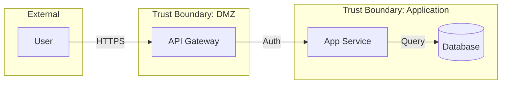

# STRIDE Threat Modeling - Technical Reference Guide

> Complete technical reference for the STRIDE Threat Modeling Skill.
> For quick start, see [README.md](README.md). | 中文版：[GUIDE-cn.md](GUIDE-cn.md)

---

## Table of Contents

1. [Installation Options](#installation-options)
2. [Design Philosophy](#design-philosophy)
3. [Core Features](#core-features)
4. [8-Phase Workflow](#8-phase-workflow)
5. [Script Reference](#script-reference)
6. [Usage Examples](#usage-examples)
7. [Knowledge Base](#knowledge-base)
8. [Testing](#testing)
9. [Troubleshooting](#troubleshooting)

---

## Installation Options

Claude Code supports two skill installation modes:

### Global Installation

将 skill 安装到用户级目录，所有项目都可使用：

```bash
# 安装位置
~/.claude/skills/threat-modeling/

# 安装命令
cp -r threat-modeling ~/.claude/skills/threat-modeling
pip install pyyaml
```

**适用场景**：
- 个人开发者日常使用
- 需要对多个项目进行威胁建模

### 项目本地安装

将 skill 安装到项目目录内，仅该项目可用：

```bash
# 安装位置
your-project/.claude/skills/threat-modeling/

# 安装命令
mkdir -p /path/to/your-project/.claude/skills
cp -r threat-modeling /path/to/your-project/.claude/skills/threat-modeling
pip install pyyaml
```

**适用场景**：
- 团队协作项目（skill 可纳入版本控制）
- 需要定制化的 skill 配置
- 安全敏感项目（知识库不共享）

### 安装优先级

当同名 skill 同时存在于全局和项目本地时：

```
项目本地 (.claude/skills/)  >  全局 (~/.claude/skills/)
```

项目本地的 skill 优先级更高，会覆盖全局同名 skill。

### 目录结构要求

无论哪种安装方式，skill 目录结构必须保持一致：

```
threat-modeling/
├── SKILL.md              # ← 必需：Claude Code 入口点
├── WORKFLOW.md           # 工作流文档
├── scripts/              # 工具脚本
│   ├── list_files.py
│   ├── stride_matrix.py
│   └── query_kb.py
└── assets/knowledge/            # 知识库
    ├── __init__.py
    └── *.yaml
```

---

## Design Philosophy

### Code-First Principle

传统威胁建模需要手动绘制 DFD 图，然后逐一分析威胁。本工具采用 **Code-First** 方法：

```
┌──────────┐    ┌──────────┐    ┌──────────┐    ┌──────────┐    ┌──────────┐
│   代码   │ ─► │ 自动分析 │ ─► │   DFD    │ ─► │  STRIDE  │ ─► │ 威胁报告 │
└──────────┘    └──────────┘    └──────────┘    └──────────┘    └──────────┘
```

### LLM + Script Collaboration Architecture

| 执行者 | 职责 | 原因 |
|--------|------|------|
| **脚本** | 文件列表、STRIDE 矩阵计算、知识库查询 | 确定性操作，可测试、可复现 |
| **LLM (Claude)** | DFD 构建、边界推导、威胁评估、报告生成 | 需要语义理解和上下文推理 |

这种分离确保了：

| 特性 | 说明 |
|------|------|
| ✅ 可测试性 | 脚本有 115 个自动化测试 |
| ✅ 可复现性 | 相同输入产生相同输出 |
| ✅ 灵活性 | LLM 可适应不同项目结构 |
| ✅ Token 效率 | 脚本执行不消耗 context |

### STRIDE per Interaction Methodology

遵循 **Microsoft Threat Modeling Tool (TMT)** 的 STRIDE per Interaction 方法：

```
                    ┌─────────────────────────────────────────┐
                    │         STRIDE Applicability            │
                    ├─────────┬───┬───┬───┬───┬───┬───────────┤
                    │ Target  │ S │ T │ R │ I │ D │ E         │
                    ├─────────┼───┼───┼───┼───┼───┼───────────┤
                    │ Process │ ✓ │ ✓ │ ✓ │ ✓ │ ✓ │ ✓         │
                    │ DataStore│   │ ✓ │ ✓ │ ✓ │ ✓ │           │
                    │ DataFlow│   │ ✓ │   │ ✓ │ ✓ │           │
                    │+ExtSource│ ✓ │   │ ✓ │   │   │           │
                    └─────────┴───┴───┴───┴───┴───┴───────────┘
```

**STRIDE 类别说明**：

| 代码 | 名称 | 安全属性 | 典型控制 |
|------|------|----------|----------|
| **S** | Spoofing | Authentication | MFA, JWT, OAuth2 |
| **T** | Tampering | Integrity | 输入验证, 数字签名 |
| **R** | Repudiation | Non-repudiation | 审计日志, 时间戳 |
| **I** | Information Disclosure | Confidentiality | 加密, 访问控制 |
| **D** | Denial of Service | Availability | 限流, 冗余, CDN |
| **E** | Elevation of Privilege | Authorization | RBAC, 最小权限 |

---

## Core Features

### Core Capabilities

| 功能 | 描述 |
|------|------|
| **项目结构分析** | 自动识别项目类型、分类文件、检测框架 |
| **DFD 构建支持** | 提供 Mermaid 模板和元素清单格式 |
| **STRIDE 矩阵计算** | TMT 兼容的 STRIDE per Interaction 矩阵 |
| **威胁 ID 生成** | 标准化格式 `T-{STRIDE}-{Element}-{Seq}` |
| **知识库查询** | 16,000+ 行 CWE/CAPEC/STRIDE 映射数据 |

### Scenario Extensions

| 扩展场景 | 描述 |
|----------|------|
| **云服务威胁** | 5 大云厂商专项威胁（AWS/Azure/GCP/阿里云/腾讯云） |
| **AI/LLM 威胁** | OWASP LLM Top 10 + AI 组件威胁 |

### Supported Project Types

```
┌─────────────────────────────────────────────────────────────┐
│                    Supported Project Types                  │
├─────────────────────────────────────────────────────────────┤
│  • Web 应用      : React, Vue, Angular                      │
│  • 后端 API      : Express, FastAPI, Spring, Go             │
│  • 微服务架构    : Docker, Kubernetes                       │
│  • AI/LLM 应用   : RAG, Agent, Model Serving                │
│  • 云原生应用    : Terraform, CloudFormation                │
│  • 混合架构      : Multi-tier, Hybrid                       │
└─────────────────────────────────────────────────────────────┘
```

### Cloud Platform Extensions

| 平台 | 服务类别 |
|------|----------|
| AWS | Compute, Storage, Database, Networking, Identity, Serverless |
| Azure | Compute, Storage, Database, Networking, Identity, Serverless |
| GCP | Compute, Storage, Database, Networking, Identity, Serverless |
| 阿里云 | Compute, Storage, Database, Networking, Identity, Serverless |
| 腾讯云 | Compute, Storage, Database, Networking, Identity, Serverless |

### AI/LLM Extensions

| 类型 | 覆盖内容 |
|------|----------|
| **OWASP LLM Top 10** | LLM01-LLM10 |
| **AI 组件** | llm_inference_service, rag_retrieval, vector_database, model_training_pipeline, agent_tool_executor |
| **架构模式** | basic_llm_api, rag_application, agent_system, multi_model_pipeline |

---

## 8-Phase Workflow

```
┌─────────┐   ┌─────────┐   ┌─────────┐   ┌─────────┐   ┌─────────┐   ┌─────────┐   ┌─────────┐
│ Phase 1 │──►│ Phase 2 │──►│ Phase 3 │──►│ Phase 4 │──►│ Phase 5 │──►│ Phase 6 │──►│ Phase 7 │
│ 项目理解 │   │调用流/DFD│   │ 信任边界 │   │ 安全设计 │   │STRIDE分析│   │ 缓解建议 │   │ 综合报告 │
└─────────┘   └─────────┘   └─────────┘   └─────────┘   └─────────┘   └─────────┘   └─────────┘
  [Script]      [Claude]     [Claude]      [Claude]    [Script+LLM]   [Claude]      [Claude]
```

---

### Phase 1: 项目理解

**目标**: 全面理解项目架构、技术栈和关键组件

**执行**:
```bash
python scripts/list_files.py /path/to/project --categorize --detect-type --pretty
```

**步骤**:
1. 获取文件结构和分类
2. 识别项目类型（从脚本输出）
3. 读取关键文件（入口点、配置、API 定义）
4. 记录框架、语言、依赖

**输出**: 架构理解 + 关键组件清单

---

### Phase 2: 调用流与 DFD 分析

**目标**: 通过追踪代码执行路径构建数据流图

**步骤**:
1. 识别外部交互者（用户、API、服务）
2. 追踪数据入口 → 处理 → 存储
3. 映射 Process、Data Store、Data Flow
4. 使用 Mermaid 语法绘制 DFD

**DFD 模板**:


**输出**: DFD 图 + 元素清单

---

### Phase 3: 信任边界评估

**目标**: 识别安全边界和信任域

**边界类型**:

| 边界类型 | 示例 |
|----------|------|
| **网络边界** | Internet / DMZ / Internal / Database tier |
| **进程边界** | Container / VM / Host |
| **用户边界** | Anonymous / Authenticated / Admin |

**输出**: 信任边界图

---

### Phase 4: 安全设计评估

**目标**: 评估现有安全机制

**检查领域**:

| 领域 | 检查项 |
|------|--------|
| Authentication | JWT, OAuth2, MFA, 会话管理 |
| Authorization | RBAC, ABAC, 资源所有权 |
| Encryption | TLS, 静态加密, 密钥管理 |
| Input Validation | 清洗, 参数化查询 |
| Logging | 审计日志, 敏感数据脱敏 |
| Rate Limiting | DoS 防护, 限流 |

**参考**: `assets/knowledge/security-controls/` 目录下的模式文档

**输出**: 安全覆盖矩阵（高亮缺失项）

---

### Phase 5: STRIDE 分析

**目标**: 使用 STRIDE per Interaction 方法系统识别威胁

**执行**:
```bash
# 1. 获取每种元素类型的适用 STRIDE
python scripts/stride_matrix.py --element process --pretty
python scripts/stride_matrix.py --element data_store --pretty
python scripts/stride_matrix.py --element data_flow --pretty

# 2. 查询知识库
python scripts/query_kb.py --stride spoofing --pretty
python scripts/query_kb.py --cwe 89 --pretty  # SQL Injection

# 3. 生成威胁 ID
python scripts/stride_matrix.py --generate-id S P1 001
# Output: T-S-P1-001
```

**输出**: 威胁清单（带 ID、CWE 映射、优先级）

---

### Phase 6: 缓解建议

**目标**: 生成技术栈特定的安全控制

**步骤**:
1. 参考 `assets/knowledge/stride-controls-mapping.yaml`
2. 映射到项目技术栈
3. 生成具体代码建议
4. 按优先级排序（Quick wins → Strategic）

**输出**: 优先级缓解建议 + 实施路线图

---

### Phase 7: 综合报告

**目标**: 生成最终威胁模型报告

**报告结构**:
```
1. Executive Summary
2. Architecture Overview + DFD
3. Trust Boundaries
4. Threat Inventory (按优先级)
5. Mitigation Roadmap
6. Compliance Mapping
```

**输出**: 完整威胁模型报告

---

## Script Reference

### list_files.py — 项目文件分析

**用途**: Phase 1 项目结构分析

```bash
python scripts/list_files.py <path> [options]
```

**参数**:

| 参数 | 短选项 | 描述 |
|------|--------|------|
| `path` | - | 项目目录路径（必需） |
| `--extensions` | `-e` | 按扩展名过滤（逗号分隔，如 `py,js,ts`） |
| `--max-depth` | `-d` | 最大目录深度 |
| `--categorize` | `-c` | 按用途分类文件 |
| `--detect-type` | `-t` | 检测项目类型 |
| `--summary-only` | `-s` | 仅输出摘要 |
| `--pretty` | `-p` | 格式化 JSON 输出 |

**文件分类规则**:

| 分类 | 匹配模式 |
|------|----------|
| `entry_points` | main.py, app.py, index.js |
| `api_routes` | routes/, controllers/ |
| `config` | config/, settings.py, .env |
| `models` | models/, assets/schemas/ |
| `auth` | auth/, security/ |
| `database` | db/, migrations/ |
| `tests` | test/, tests/ |
| `deploy` | Dockerfile, docker-compose.yml |
| `docs` | README, references/ |

**项目类型检测**:

| 类型 | 检测依据 |
|------|----------|
| `python` | .py, requirements.txt, setup.py |
| `javascript` | .js, package.json |
| `typescript` | .ts, tsconfig.json |
| `go` | .go, go.mod |
| `java` | .java, pom.xml |
| `rust` | .rs, Cargo.toml |
| `docker` | Dockerfile, docker-compose.yml |
| `kubernetes` | deployment.yaml, service.yaml |
| `terraform` | .tf |

**示例**:
```bash
# 完整分析
python scripts/list_files.py ./my-project --categorize --detect-type --pretty

# 仅 Python 文件
python scripts/list_files.py ./my-project --extensions py --pretty

# 限制深度
python scripts/list_files.py ./my-project --max-depth 3 --pretty
```

---

### stride_matrix.py — STRIDE 矩阵计算

**用途**: Phase 5 STRIDE 威胁生成

```bash
python scripts/stride_matrix.py [options]
```

**参数**:

| 参数 | 短选项 | 描述 |
|------|--------|------|
| `--element` | `-e` | 获取元素类型的适用 STRIDE |
| `--interaction` | `-i` | 分析源-目标交互 |
| `--generate-id` | `-g` | 生成威胁 ID |
| `--show-matrix` | `-m` | 显示完整 STRIDE 矩阵 |
| `--pretty` | `-p` | 格式化 JSON 输出 |

**元素类型**:

| 类型 | 适用 STRIDE | 说明 |
|------|-------------|------|
| `process` | S, T, R, I, D, E | 处理数据的代码 |
| `data_store` | T, R, I, D | 数据库、文件、缓存 |
| `data_flow` | T, I, D | 数据传输 |
| `external_interactor` | S, R | 外部用户/系统 |

**威胁 ID 格式**: `T-{STRIDE}-{ElementID}-{Sequence}`

| 示例 | 含义 |
|------|------|
| `T-S-P1-001` | Process 1 的 Spoofing 威胁 #001 |
| `T-T-DF1-002` | DataFlow 1 的 Tampering 威胁 #002 |
| `T-E-GW-001` | Gateway 的 Elevation of Privilege 威胁 #001 |

**示例**:
```bash
# 获取 Process 的适用 STRIDE
python scripts/stride_matrix.py --element process --pretty

# 生成威胁 ID
python scripts/stride_matrix.py --generate-id S GW 001

# 显示完整矩阵
python scripts/stride_matrix.py --show-matrix --pretty
```

---

### query_kb.py — 知识库查询

**用途**: Phase 5-6 威胁知识和缓解查询

```bash
python scripts/query_kb.py [options]
```

**STRIDE 查询**:

| 参数 | 短选项 | 描述 |
|------|--------|------|
| `--stride` | `-s` | 查询 STRIDE 类别 |
| `--cwe` | `-c` | 查询特定 CWE |
| `--element` | `-e` | 查询元素类型的适用 STRIDE |
| `--all-stride` | `-a` | 获取所有 STRIDE 类别概览 |

**云服务查询**:

| 参数 | 描述 |
|------|------|
| `--cloud` | 查询云提供商（aws/azure/gcp/alibaba/tencent） |
| `--category` | 云服务类别（与 --cloud 配合） |
| `--cloud-category` | 查询所有云厂商的特定类别威胁 |

**AI/LLM 查询**:

| 参数 | 描述 |
|------|------|
| `--llm` | 查询 OWASP LLM Top 10（LLM01-LLM10） |
| `--all-llm` | 获取所有 OWASP LLM Top 10 概览 |
| `--ai-component` | 查询 AI 组件威胁 |
| `--ai-architecture` | 查询 AI 架构模式威胁 |

**验证测试查询 (v2.0)**:

| 参数 | 描述 |
|------|------|
| `--stride-tests` | 获取 STRIDE 类别的验证测试（S/T/R/I/D/E） |
| `--cwe-tests` | 获取 CWE 的验证测试 |
| `--wstg-category` | 按类别查询 WSTG 测试（ATHN/AUTHZ/INPV/SESS 等） |
| `--mastg-platform` | 按平台查询 MASTG 测试（android/ios） |
| `--asvs-level` | 按级别查询 ASVS 要求（L1/L2/L3） |
| `--asvs-chapter` | 按章节查询 ASVS 要求（V1-V14） |
| `--verification-stats` | 获取验证测试统计（121 WSTG + 206 MASTG + 345 ASVS = 1,269 mappings） |

**示例**:
```bash
# STRIDE 查询
python scripts/query_kb.py --stride spoofing --pretty
python scripts/query_kb.py --cwe 89 --pretty
python scripts/query_kb.py --all-stride --pretty

# 云服务查询
python scripts/query_kb.py --cloud aws --pretty
python scripts/query_kb.py --cloud aws --category compute --pretty
python scripts/query_kb.py --cloud-category storage --pretty

# AI/LLM 查询
python scripts/query_kb.py --llm LLM01 --pretty
python scripts/query_kb.py --all-llm --pretty
python scripts/query_kb.py --ai-component rag_retrieval --pretty
python scripts/query_kb.py --ai-architecture agent_system --pretty

# 验证测试查询 (v2.0)
python scripts/query_kb.py --stride-tests S --pretty         # Spoofing: 240 tests
python scripts/query_kb.py --stride-tests T --pretty         # Tampering: 402 tests
python scripts/query_kb.py --cwe-tests CWE-89 --pretty       # SQL注入验证测试
python scripts/query_kb.py --wstg-category ATHN --pretty     # 认证测试
python scripts/query_kb.py --mastg-platform android --pretty # Android测试
python scripts/query_kb.py --asvs-level L1 --pretty          # ASVS Level 1
python scripts/query_kb.py --verification-stats --pretty     # 统计摘要
```

---

## Usage Examples

### 示例 1: REST API 快速评估

```bash
# 1. 理解项目
python scripts/list_files.py ./express-api --categorize --detect-type --pretty

# 2. STRIDE 分析
python scripts/stride_matrix.py --element process --pretty
python scripts/query_kb.py --stride spoofing --pretty
python scripts/query_kb.py --stride elevation_of_privilege --pretty

# 3. Claude 输出威胁清单
```

**输出示例**:
```markdown
## Quick Security Assessment: express-api

**Threats Found**: 4 (1 Critical, 1 High, 2 Medium)

### Critical Finding
**T-E-P2-001**: DELETE /users/:id lacks authorization check.

### Mitigation
Add ownership verification before delete operation.
```

### 示例 2: 微服务完整评估

完整案例参见 `EXAMPLES.md` 中的 Example 2。

### 示例 3: AI/LLM 应用评估

```bash
# 查询 LLM 特定威胁
python scripts/query_kb.py --all-llm --pretty
python scripts/query_kb.py --llm LLM01 --pretty  # Prompt Injection
python scripts/query_kb.py --ai-component rag_retrieval --pretty
```

**额外威胁关注点**:
- LLM01: Prompt Injection
- LLM02: Insecure Output Handling
- LLM06: Sensitive Information Disclosure
- LLM08: Excessive Agency

### 示例 4: 多云 SaaS 评估

完整案例参见 `EXAMPLES.md` 中的 Example 5。

---

## Knowledge Base

### File Structure

```
assets/knowledge/
├── __init__.py                  # SecurityKnowledgeBase API (714 lines)
├── cwe-mappings.yaml            # CWE 到 STRIDE 映射 (2,510 lines)
├── capec-mappings.yaml          # 攻击模式 (7,445 lines)
├── comprehensive-mappings.yaml  # 综合映射 (4,441 lines)
├── stride-library.yaml          # STRIDE 定义 + 过滤器 (233 lines)
├── stride-controls-mapping.yaml # STRIDE 到控制映射 (210 lines)
├── cloud-services.yaml          # 多云服务威胁 (574 lines)
├── llm-threats.yaml             # OWASP LLM Top 10 (833 lines)
└── security-controls/           # 安全控制参考 (11 files)
    ├── auth-patterns-reference.md
    ├── codeguard-0-*.md
    └── codeguard-1-*.md
```

### Usage Principles

> ⚠️ **不要直接读取 YAML 文件到 context** — 使用 `query_kb.py` 脚本按需查询

### API Categories

`SecurityKnowledgeBase` 类提供以下方法：

| 方法 | 描述 |
|------|------|
| `get_cwes_for_stride(category)` | 获取 STRIDE 类别的 CWE |
| `get_capecs_for_cwe(cwe_id)` | 获取 CWE 的 CAPEC |
| `get_stride_for_element(element_type)` | 获取元素类型的适用 STRIDE |
| `get_cwe_entry(cwe_id)` | 获取 CWE 详情 |
| `get_security_mapping(stride_category)` | 获取综合映射 |

---

## Testing

### Running Tests

```bash
cd threat-modeling

# 全部测试 (115 tests)
./tmp_check/run_tests.sh

# 或使用 pytest
python -m pytest tmp_check/ -v --tb=short
```

### Test Coverage

| 测试文件 | 测试数 | 覆盖范围 |
|----------|--------|----------|
| test_data_integrity.py | 21 | YAML 语法、数据计数 |
| test_knowledge_base.py | 18 | KB API、枚举、缓存 |
| test_list_files.py | 12 | 文件列表、分类 |
| test_query_kb.py | 37 | STRIDE/CWE/Cloud/LLM 查询 |
| test_stride_matrix.py | 12 | STRIDE 矩阵、威胁 ID |
| test_workflow.py | 15 | E2E 工作流阶段 |
| **Total** | **115** | |

### Quick Validation

```bash
# 验证脚本
python scripts/list_files.py --help
python scripts/stride_matrix.py --show-matrix --pretty
python scripts/query_kb.py --all-stride --pretty
```

---

## Troubleshooting

### Common Issues

| 问题 | 解决方案 |
|------|----------|
| `ModuleNotFoundError: yaml` | `pip install pyyaml` |
| 脚本找不到知识库 | 确保从 `threat-modeling/` 目录运行 |
| JSON 解析错误 | 确保使用 `--pretty` 检查输出格式 |
| 威胁 ID 生成失败 | 检查 STRIDE 代码是否为 S/T/R/I/D/E |

### Best Practices

| ✅ 推荐 | ❌ 避免 |
|---------|---------|
| 使用 `query_kb.py` 查询知识库 | 直接加载 YAML 文件到 context |
| 先构建 DFD 再做 STRIDE 分析 | 跳过 DFD 直接分析威胁 |
| 针对技术栈定制缓解建议 | 使用通用缓解建议 |
| 检查部署配置识别信任边界 | 忽略网络分段 |
| 对 AI 组件应用 OWASP LLM Top 10 | 忽略 LLM 特定漏洞 |

---

## Related Documentation

| 文档 | 描述 |
|------|------|
| [README.md](README.md) | 快速入门和安装 |
| [SKILL.md](SKILL.md) | Claude Code skill 入口点 |
| [WORKFLOW.md](WORKFLOW.md) | 详细 8 阶段工作流模板 |
| [EXAMPLES.md](EXAMPLES.md) | 5 个真实案例 |
| [PROGRESS.md](PROGRESS.md) | 项目进度和评估记录 |

---

<div align="center">

**版本 1.0.1** · Production Ready · 8-Phase Deep Workflow

</div>
