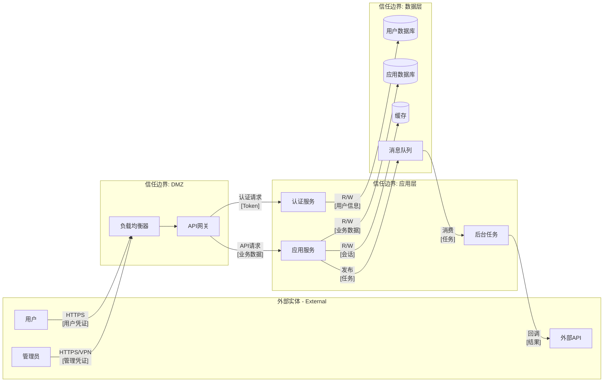

<!-- Code-First Deep Threat Modeling Workflow | Version 2.1.0 | https://github.com/fr33d3m0n/skill-threat-modeling | License: BSD-3-Clause | Welcome to cite but please retain all sources and declarations -->

# Code-First Deep Risk Analysis Workflow

Detailed 8-phase workflow guide for comprehensive code-first threat modeling.

## Workflow Overview

```
┌─────────────────────────────────────────────────────────────────────────────────────────┐
│                           8-Phase Deep Threat Modeling                                   │
├─────────────────────────────────────────────────────────────────────────────────────────┤
│                                                                                          │
│  Phase 1 ──► Phase 2 ──► Phase 3 ──► Phase 4 ──► Phase 5 ──► Phase 6 ──► Phase 7 ──► Phase 8  │
│  Project     Call Flow   Trust      Security    STRIDE      Risk        Mitigation   Report  │
│  Understanding  DFD     Boundaries   Design    Analysis   Validation                         │
│                                                                                          │
│  ┌────────────────────────────────────────────────────────────────────────────────────┐ │
│  │                         串行执行 + 输出传递                                         │ │
│  │                                                                                     │ │
│  │  Phase N Output ────────────────────────────────────────────► Phase N+1 Input      │ │
│  │                                                                                     │ │
│  │  每阶段结束:  深度分析 ──► 总结 ──► 反思 ──► 确认 ──► 下一阶段                      │ │
│  └────────────────────────────────────────────────────────────────────────────────────┘ │
│                                                                                          │
└─────────────────────────────────────────────────────────────────────────────────────────┘
```

**Execution Rules**:
1. **Strict Serial Execution**: Phases 1→2→3→4→5→6→7→8, no skipping or reordering
2. **Output Propagation**: Each phase receives previous phase outputs as input
3. **Reflection Checkpoints**: Summary and reflection after each phase
4. **Deep Thinking**: All phases use `<ultrathink><critical thinking>` mode
5. **KB Integration**: Phases 5/6/7 must query knowledge base for each risk
6. **Parallel Sub-Agents**: Multi-risk analysis within phases can parallelize

---

## Phase 1: Project Understanding <ultrathink><critical thinking>

**Goal**: Comprehensively understand the project's architecture, features, modules, and security-relevant design.

### Steps

1. **Get file structure**
   ```bash
   python scripts/list_files.py <project-path> --categorize --detect-type --pretty
   ```

2. **Identify project type** from script output:
   - Web application (React, Vue, Angular, Next.js)
   - Backend API (Express, FastAPI, Spring Boot, Django)
   - Microservices (multiple services, Docker, Kubernetes)
   - AI/LLM application (model loading, inference, RAG)
   - Hybrid (combination of above)

3. **Collect project scale metrics**:
   Use code analysis tools to gather quantitative project metrics:
   ```bash
   # Option 1: Using cloc (recommended)
   cloc <project-path> --json --quiet

   # Option 2: Using tokei
   tokei <project-path> --output json

   # Option 3: Manual collection
   find <project-path> -type f -name "*.py" | wc -l  # file count
   find <project-path> -type f -name "*.py" -exec cat {} + | wc -l  # LOC
   ```

   Collect these metrics:
   - **Total LOC** (Lines of Code, excluding blanks/comments)
   - **File count** by language
   - **Directory count** (code directories)
   - **Module count** (top-level functional modules)
   - **Dependency count** (from package manifests)
   - **Language distribution** (percentage by language)

4. **Read key files** (priority order):
   - Entry points: `main.py`, `app.py`, `index.js`, `server.js`
   - Config files: `config/`, `.env.example`, `settings.py`
   - API definitions: `routes/`, `api/`, `controllers/`
   - Package manifests: `package.json`, `requirements.txt`, `go.mod`
   - Security config: auth middleware, CORS settings, security headers

5. **Document architecture understanding**:
   - Core functionality and business logic
   - User roles and access patterns
   - External service integrations
   - Data sensitivity classification

### Required Output Template

```markdown
## 项目概要

**项目类型**: [Web App | API | 微服务 | AI/LLM | 混合]
**主要语言**: [Language]
**框架**: [Framework list]
**部署方式**: [Cloud/On-premise/Hybrid]

## 项目规模指标

### 代码统计
| 指标 | 数值 | 说明 |
|------|------|------|
| **代码总行数** | [N] | 不含空行和注释 |
| **文件总数** | [N] | 源代码文件 |
| **目录数** | [N] | 代码目录 |
| **主要模块数** | [N] | 顶层功能模块 |
| **依赖数量** | [N] | 直接依赖 |

### 语言分布
| 语言 | 文件数 | 代码行数 | 占比 |
|------|--------|---------|------|
| [Language 1] | [N] | [N] | [N]% |
| [Language 2] | [N] | [N] | [N]% |
| [Language N] | [N] | [N] | [N]% |

### 安全相关模块统计
| 模块类型 | 路径 | 文件数 | 行数 | 安全等级 |
|---------|------|--------|------|---------|
| 认证/授权 | src/auth/ | [N] | [N] | 高 |
| 加密/密钥 | src/crypto/ | [N] | [N] | 高 |
| 数据访问 | src/models/ | [N] | [N] | 高 |
| API接口 | src/api/ | [N] | [N] | 中 |
| 配置管理 | config/ | [N] | [N] | 中 |

## 功能描述

### 核心功能
1. [功能1]: [描述]
2. [功能2]: [描述]
3. [功能N]: [描述]

### 用户角色
| 角色 | 权限级别 | 可访问资源 |
|------|---------|-----------|
| 匿名用户 | 低 | 公开API |
| 注册用户 | 中 | 个人数据 |
| 管理员 | 高 | 所有数据 |

## 主要模块

| 模块 | 职责 | 位置 | 安全相关性 |
|------|------|------|-----------|
| 认证模块 | 用户认证 | src/auth/ | 高 |
| API层 | 请求处理 | src/api/ | 高 |
| 数据层 | 数据访问 | src/models/ | 高 |
| 业务逻辑 | 核心功能 | src/services/ | 中 |

## 关键安全设计

### 认证机制
- 认证方式: [JWT/Session/OAuth2]
- 密码策略: [有/无/部分]
- MFA支持: [有/无]

### 数据存储
- 主数据库: [类型]
- 敏感数据加密: [有/无/部分]
- 备份机制: [有/无]

### 外部集成
| 服务 | 用途 | 认证方式 | 数据交换 |
|------|------|---------|---------|
| [服务名] | [用途] | [API Key/OAuth] | [数据类型] |

### 初步安全观察
- 强项: [...]
- 潜在问题: [...]
```

### Checkpoint

Before proceeding to Phase 2, verify:
- [ ] Project type clearly identified
- [ ] **Project scale metrics collected** (LOC, files, language distribution)
- [ ] All entry points located
- [ ] Key modules documented with security relevance
- [ ] Technology stack fully understood
- [ ] External integrations mapped
- [ ] Initial security observations noted

**Reflection**: Summarize key findings and security-relevant insights. Note any areas requiring deeper investigation.

---

## Phase 2: Call Flow & DFD Analysis <ultrathink><critical thinking>

**Goal**: Build comprehensive Data Flow Diagram by tracing how data moves through the system.

**Must Use**: Phase 1 output (project overview, modules, integrations)

### Steps

1. **Identify External Interactors**
   From Phase 1 user roles and integrations:
   - Human users (web, mobile, API clients)
   - External services (payment, auth, third-party APIs)
   - Scheduled jobs, message queues
   - Admin interfaces

2. **Trace Data Entry Points**
   For each external interactor:
   ```
   External Interactor → [Entry Point] → Process → Storage
   ```
   Look for:
   - HTTP handlers (`@app.route`, `router.get`, `@GetMapping`)
   - Message consumers (`@consumer`, `subscribe`, `on_message`)
   - File uploads, webhooks, WebSocket handlers

3. **Map Processes**
   For each entry point, trace the call flow:
   - What functions process the data?
   - What transformations occur?
   - What validations are performed?
   - Where does data branch or merge?

4. **Identify Data Stores**
   - Primary databases (SQL, NoSQL)
   - Caches (Redis, Memcached)
   - File storage (S3, local filesystem)
   - Session stores, temp files
   - Logs and audit trails

5. **Draw DFD using Mermaid**

### DFD Template



### Element Inventory Template

```markdown
## DFD 元素清单

### 外部实体 (External Interactors)
| ID | 名称 | 类型 | 发送数据 | 接收数据 |
|----|------|------|---------|---------|
| EI1 | 用户 | 人类 | 凭证, API请求 | 响应数据 |
| EI2 | 管理员 | 人类 | 管理命令 | 管理数据 |
| EI3 | 外部API | 系统 | 回调数据 | API请求 |

### 进程 (Processes)
| ID | 名称 | 功能 | 认证要求 | 授权要求 |
|----|------|------|---------|---------|
| P1 | API网关 | 请求路由 | 是 | 部分 |
| P2 | 认证服务 | 身份验证 | 否 | 否 |
| P3 | 应用服务 | 业务逻辑 | 是 | 是 |
| P4 | 后台任务 | 异步处理 | 系统 | 系统 |

### 数据存储 (Data Stores)
| ID | 名称 | 类型 | 敏感度 | 加密 | 备份 |
|----|------|------|--------|------|------|
| DS1 | 用户数据库 | PostgreSQL | 高(PII) | 是 | 是 |
| DS2 | 应用数据库 | MongoDB | 中 | 部分 | 是 |
| DS3 | 缓存 | Redis | 中(会话) | 否 | 否 |

### 数据流 (Data Flows)
| ID | 从 | 到 | 数据 | 协议 | 加密 |
|----|-----|-----|------|------|------|
| DF1 | EI1 | P1 | 用户请求 | HTTPS | 是 |
| DF2 | P1 | P2 | 认证请求 | gRPC | 是 |
| DF3 | P2 | DS1 | 用户查询 | TCP | 是 |
| DF4 | P3 | DS2 | 业务数据 | TCP | 部分 |
```

### Checkpoint

Before proceeding to Phase 3, verify:
- [ ] All external interactors identified
- [ ] All processes mapped with their functions
- [ ] All data stores documented with sensitivity
- [ ] All data flows traced with protocols
- [ ] DFD diagram complete and accurate
- [ ] Element inventory complete

**Reflection**: Review DFD for completeness. Identify high-risk data flows (sensitive data, cross-boundary).

---

## Phase 3: Trust Boundary Evaluation <ultrathink><critical thinking>

**Goal**: Based on Phase 2 DFD, identify key interfaces, boundaries, data nodes and analyze current security posture.

**Must Use**: Phase 2 output (DFD diagram, element inventory)

### Steps

1. **Identify Network Boundaries**
   From Phase 2 DFD, mark:
   - Internet-facing components (DMZ)
   - Internal network segments
   - Database tier isolation
   - Third-party integration points

2. **Identify Process Boundaries**
   - Container boundaries (Docker, Kubernetes pods)
   - VM/Host boundaries
   - Serverless function isolation
   - Microservice boundaries

3. **Identify User Trust Levels**
   From Phase 1 user roles:
   - Anonymous users (no authentication)
   - Authenticated users (verified identity)
   - Privileged users (admin, operators)
   - System accounts (service principals)

4. **Mark Critical Cross-Boundary Flows**
   High-priority analysis targets:
   - Internet → DMZ
   - DMZ → Application tier
   - Application → Database tier
   - Internal → External services

5. **Analyze Security at Each Boundary**
   For each boundary crossing, document:
   - Current security controls
   - Data exposed
   - Potential risks

### Key Interfaces Analysis Template

```markdown
## 关键接口分析

### 接口清单
| 接口ID | 名称 | 类型 | 源边界 | 目标边界 | 协议 |
|--------|------|------|--------|---------|------|
| IF1 | 用户API | HTTP | Internet | DMZ | HTTPS |
| IF2 | 内部RPC | gRPC | DMZ | Application | mTLS |
| IF3 | 数据库连接 | TCP | Application | Data | TLS |
| IF4 | 外部回调 | HTTP | Application | External | HTTPS |

### 接口安全评估
| 接口ID | 当前安全控制 | 评估 | 潜在风险 |
|--------|-------------|------|---------|
| IF1 | WAF, Rate Limit, JWT | 良好 | Token劫持 |
| IF2 | mTLS, 服务认证 | 良好 | 证书管理 |
| IF3 | 用户名/密码, 网络隔离 | 一般 | 凭证泄露 |
| IF4 | API Key, IP白名单 | 一般 | Key泄露 |
```

### Trust Boundary Template

```markdown
## 信任边界分析

### 边界清单
| 边界 | 类型 | 包含组件 | 保护机制 | 评估 |
|------|------|---------|---------|------|
| Internet Edge | 网络 | 负载均衡器 | WAF, DDoS防护, TLS | 强 |
| DMZ | 网络 | API网关, 认证服务 | 防火墙, 入侵检测 | 强 |
| Application | 进程 | 应用服务, 后台任务 | mTLS, RBAC | 中 |
| Data | 网络 | 数据库, 缓存 | 网络隔离, 加密 | 中 |

### 跨边界数据流 (高优先级)
| 流ID | 从边界 | 到边界 | 数据敏感度 | 风险等级 | 当前控制 |
|------|--------|--------|-----------|---------|---------|
| DF1 | Internet | DMZ | 高(凭证) | 高 | TLS, 验证 |
| DF3 | DMZ | Application | 中 | 中 | mTLS |
| DF5 | Application | Data | 高(PII) | 高 | 加密连接 |
```

### Key Data Nodes Template

```markdown
## 关键数据节点

### 数据节点分析
| 节点 | 存储数据 | 敏感度 | 加密状态 | 访问控制 | 备份 |
|------|---------|--------|---------|---------|------|
| UserDB | 用户PII, 密码哈希 | 高 | 传输+存储 | RBAC | 每日 |
| AppDB | 业务数据 | 中 | 传输 | 应用级 | 每日 |
| Cache | 会话Token | 高 | 无 | 网络隔离 | 无 |
| Logs | 审计日志 | 中 | 传输 | 只读 | 长期 |

### 数据节点风险评估
| 节点 | 已识别风险 | 当前缓解 | 差距 |
|------|-----------|---------|------|
| Cache | 会话劫持 | 过期时间 | 无加密 |
| Logs | 敏感数据泄露 | 脱敏 | 部分覆盖 |
```

### Checkpoint

Before proceeding to Phase 4, verify:
- [ ] All network boundaries identified
- [ ] All process boundaries identified
- [ ] User trust levels defined
- [ ] Key interfaces documented with security assessment
- [ ] Cross-boundary flows marked with risk levels
- [ ] Key data nodes analyzed

**Reflection**: Summarize boundary security posture. Identify weak boundaries and high-risk crossings.

---

## Phase 4: Security Design Assessment <ultrathink><critical thinking>

**Goal**: Based on Phases 1-3, perform deep analysis of security design across all domains.

**Must Use**:
- Phase 1: Project overview, modules, security design
- Phase 2: DFD, data flows, processes
- Phase 3: Boundaries, interfaces, data nodes

### Security Domains (Must Cover All)

1. **身份管理 (Identity Management)**
2. **认证 (Authentication)**
3. **授权/访问控制 (Authorization/Access Control)**
4. **加密与密钥管理 (Encryption & Key Management)**
5. **日志与审计 (Logging & Audit)**
6. **敏感数据保护 (Sensitive Data Protection)**
7. **高可用性 (High Availability)**
8. **输入验证 (Input Validation)**
9. **会话管理 (Session Management)**

### Security Assessment Template

```markdown
## 安全设计评估矩阵

### 1. 身份管理
| 控制点 | 当前实现 | 评估 | 差距 |
|--------|---------|------|------|
| 用户注册 | Email验证 | ✓ | - |
| 身份验证来源 | 本地 + OAuth | ✓ | - |
| 身份生命周期 | 手动管理 | △ | 无自动化 |
| 特权账户管理 | 无特殊处理 | ✗ | 需要PAM |

### 2. 认证
| 控制点 | 当前实现 | 评估 | 差距 |
|--------|---------|------|------|
| 密码策略 | 8字符最小 | △ | 需要复杂度 |
| MFA | 无 | ✗ | 高风险 |
| 登录失败锁定 | 5次/15分钟 | ✓ | - |
| 密码重置 | Email链接 | ✓ | - |

### 3. 授权/访问控制
| 控制点 | 当前实现 | 评估 | 差距 |
|--------|---------|------|------|
| RBAC | 基础角色 | △ | 粒度不足 |
| 资源所有权 | 用户ID检查 | ✓ | - |
| API授权 | JWT scope | ✓ | - |
| 最小权限 | 部分实施 | △ | 需审计 |

### 4. 加密与密钥管理
| 控制点 | 当前实现 | 评估 | 差距 |
|--------|---------|------|------|
| 传输加密 | TLS 1.2+ | ✓ | - |
| 存储加密 | 数据库级 | ✓ | - |
| 密钥存储 | 环境变量 | ✗ | 需要KMS |
| 密钥轮换 | 无 | ✗ | 高风险 |

### 5. 日志与审计
| 控制点 | 当前实现 | 评估 | 差距 |
|--------|---------|------|------|
| 安全事件日志 | 部分 | △ | 覆盖不全 |
| 审计跟踪 | 无 | ✗ | 需要实现 |
| 日志保护 | 只读权限 | ✓ | - |
| 敏感数据脱敏 | 部分 | △ | 需要增强 |

### 6. 敏感数据保护
| 控制点 | 当前实现 | 评估 | 差距 |
|--------|---------|------|------|
| PII分类 | 无 | ✗ | 需要分类 |
| 数据最小化 | 部分 | △ | 需审计 |
| 数据脱敏 | API响应 | △ | 日志缺失 |
| 数据保留策略 | 无 | ✗ | 合规风险 |

### 7. 高可用性
| 控制点 | 当前实现 | 评估 | 差距 |
|--------|---------|------|------|
| 冗余部署 | 多实例 | ✓ | - |
| 故障转移 | 自动 | ✓ | - |
| 备份恢复 | 每日 | ✓ | - |
| DDoS防护 | CDN级 | ✓ | - |

### 8. 输入验证
| 控制点 | 当前实现 | 评估 | 差距 |
|--------|---------|------|------|
| 类型验证 | Schema | ✓ | - |
| 长度限制 | 部分 | △ | 不一致 |
| 格式验证 | 正则 | ✓ | - |
| 编码处理 | 部分 | △ | XSS风险 |

### 9. 会话管理
| 控制点 | 当前实现 | 评估 | 差距 |
|--------|---------|------|------|
| 会话过期 | 24小时 | △ | 过长 |
| 安全Cookie | HttpOnly, Secure | ✓ | - |
| 并发会话 | 无限制 | ✗ | 需要限制 |
| 会话固定防护 | 登录后重生成 | ✓ | - |
```

### Gap Summary Template

```markdown
## 安全差距汇总

### 按风险等级排序
| 风险等级 | 安全域 | 差距描述 | 影响 |
|---------|--------|---------|------|
| 高 | 认证 | 无MFA | 账户劫持风险 |
| 高 | 密钥管理 | 无密钥轮换 | 长期密钥暴露 |
| 高 | 敏感数据 | 无数据分类 | 合规违规 |
| 中 | 授权 | RBAC粒度不足 | 过度权限 |
| 中 | 日志 | 审计不完整 | 事件追溯困难 |
| 低 | 输入验证 | 长度限制不一致 | 潜在注入 |
```

### Checkpoint

Before proceeding to Phase 5, verify:
- [ ] All 9 security domains evaluated
- [ ] Current implementation documented
- [ ] Gaps identified with risk levels
- [ ] Gap summary prioritized

**Reflection**: Summarize overall security design maturity. Identify critical gaps requiring immediate attention.

---

## Phase 5: STRIDE Analysis <ultrathink><critical thinking>

**Goal**: Comprehensive threat analysis using STRIDE + CWE + ATT&CK + LLM threats.

**Must Use**:
- Phase 2: DFD elements
- Phase 3: Boundaries, interfaces
- Phase 4: Security gaps

### Steps

1. **Get applicable STRIDE categories for each element**
   ```bash
   python scripts/stride_matrix.py --element process --pretty
   python scripts/stride_matrix.py --element data_store --pretty
   python scripts/stride_matrix.py --element data_flow --pretty
   ```

2. **Apply STRIDE Matrix**

   | Target Type | S | T | R | I | D | E |
   |-------------|---|---|---|---|---|---|
   | Process | ✓ | ✓ | ✓ | ✓ | ✓ | ✓ |
   | Data Store | - | ✓ | ✓ | ✓ | ✓ | - |
   | Data Flow | - | ✓ | - | ✓ | ✓ | - |
   | + External Source | ✓ | - | ✓ | - | - | - |

3. **For each threat, query knowledge base** (可并行):
   ```bash
   # Full chain for comprehensive context
   python scripts/unified_kb_query.py --full-chain CWE-XXX

   # STRIDE category details
   python scripts/unified_kb_query.py --stride spoofing

   # For AI/LLM components
   python scripts/unified_kb_query.py --all-llm
   python scripts/unified_kb_query.py --llm LLM01

   # Semantic search for related threats
   python scripts/unified_kb_query.py --semantic-search "authentication bypass"
   ```

4. **Map threats to CWE/CAPEC/ATT&CK**

5. **Generate Threat IDs**
   ```bash
   python scripts/stride_matrix.py --generate-id S P1 001
   # Output: T-S-P1-001
   ```

6. **Assess and prioritize**
   - **Critical**: Exploitable + High impact + No mitigation
   - **High**: Exploitable + Medium-high impact
   - **Medium**: Requires conditions + Medium impact
   - **Low**: Theoretical + Low impact

### Parallel Sub-Agent Pattern for Multi-Threat Analysis <ultrathink><critical thinking>

For each DFD element:
```
Main Agent
    │
    ├──► Threat 1 ──► Sub-Agent ──► KB Query (--full-chain) ──► Analysis
    ├──► Threat 2 ──► Sub-Agent ──► KB Query (--full-chain) ──► Analysis
    └──► Threat N ──► Sub-Agent ──► KB Query (--full-chain) ──► Analysis
    │
    ◄───────────── Aggregate Results ──────────────
```

#### Sub-Agent Error Handling (子代理错误处理)

```yaml
error_handling:
  # ─────────────────────────────────────────────────────────────
  # 单个风险处理失败
  # ─────────────────────────────────────────────────────────────
  single_risk_failure:
    action: "log_error_and_continue"   # 记录错误并继续
    record_to: "failed_risks[]"        # 记录到失败列表
    retry:
      enabled: true
      max_attempts: 2
      backoff: "exponential"           # 指数退避

  # ─────────────────────────────────────────────────────────────
  # 失败容忍阈值
  # ─────────────────────────────────────────────────────────────
  failure_threshold:
    max_percentage: 10%                # 最多10%风险可失败
    max_absolute: 5                    # 或最多5个绝对数
    condition: "whichever is higher"   # 取较高值
    on_exceed: "abort_phase_with_partial_results"

  # ─────────────────────────────────────────────────────────────
  # 部分结果聚合
  # ─────────────────────────────────────────────────────────────
  aggregation_with_failures:
    include_partial_results: true
    mark_failed_risks: "⚠️ INCOMPLETE"
    report_summary:
      format: "{success_count} of {total_count} risks processed successfully"
      include_failure_reasons: true

  # ─────────────────────────────────────────────────────────────
  # 错误分类
  # ─────────────────────────────────────────────────────────────
  error_classification:
    recoverable:
      - "KB_QUERY_TIMEOUT"             # 知识库查询超时 → 重试
      - "CWE_NOT_FOUND"                # CWE未找到 → 使用CWE-UNKNOWN
      - "CAPEC_MAPPING_FAILED"         # CAPEC映射失败 → 跳过映射
    non_recoverable:
      - "INVALID_RISK_FORMAT"          # 风险格式无效 → 标记失败
      - "CONTEXT_OVERFLOW"             # 上下文溢出 → 拆分子任务
```

#### Failure Report Template

```markdown
## 处理失败报告

### 统计
- 总风险数: {total_count}
- 成功处理: {success_count}
- 失败: {failure_count} ({failure_percentage}%)

### 失败详情
| 风险ID | 错误类型 | 错误信息 | 重试次数 |
|--------|---------|---------|---------|
| VR-XXX | KB_QUERY_TIMEOUT | "CWE-XXX query timed out after 30s" | 2 |
```

### Threat Inventory Template

```markdown
## STRIDE 威胁清单

### 按类别汇总
| STRIDE | 数量 | Critical | High | Medium | Low |
|--------|------|----------|------|--------|-----|
| Spoofing | X | X | X | X | X |
| Tampering | X | X | X | X | X |
| Repudiation | X | X | X | X | X |
| Info Disclosure | X | X | X | X | X |
| Denial of Service | X | X | X | X | X |
| Elevation | X | X | X | X | X |
| **Total** | X | X | X | X | X |

### Spoofing 威胁
| 威胁ID | 元素 | 威胁描述 | CWE | CAPEC | 优先级 |
|--------|------|---------|-----|-------|--------|
| T-S-P1-001 | API网关 | 凭证填充攻击 | CWE-307 | CAPEC-600 | High |
| T-S-P1-002 | API网关 | JWT伪造 | CWE-347 | CAPEC-220 | High |

### Tampering 威胁
| 威胁ID | 元素 | 威胁描述 | CWE | CAPEC | 优先级 |
|--------|------|---------|-----|-------|--------|
| T-T-DF1-001 | 用户输入 | SQL注入 | CWE-89 | CAPEC-66 | Critical |
| T-T-DF2-001 | API请求 | 参数篡改 | CWE-639 | CAPEC-88 | High |

### Repudiation 威胁
| 威胁ID | 元素 | 威胁描述 | CWE | CAPEC | 优先级 |
|--------|------|---------|-----|-------|--------|
| T-R-P3-001 | 应用服务 | 缺少审计日志 | CWE-778 | - | Medium |

### Information Disclosure 威胁
| 威胁ID | 元素 | 威胁描述 | CWE | CAPEC | 优先级 |
|--------|------|---------|-----|-------|--------|
| T-I-DS1-001 | 用户数据库 | PII泄露 | CWE-359 | CAPEC-116 | High |
| T-I-DF3-001 | 数据库连接 | 敏感数据传输 | CWE-319 | CAPEC-157 | Medium |

### Denial of Service 威胁
| 威胁ID | 元素 | 威胁描述 | CWE | CAPEC | 优先级 |
|--------|------|---------|-----|-------|--------|
| T-D-P1-001 | API网关 | 速率限制绕过 | CWE-400 | CAPEC-469 | Medium |

### Elevation of Privilege 威胁
| 威胁ID | 元素 | 威胁描述 | CWE | CAPEC | 优先级 |
|--------|------|---------|-----|-------|--------|
| T-E-P3-001 | 应用服务 | IDOR | CWE-639 | CAPEC-122 | High |
| T-E-P3-002 | 应用服务 | 权限提升 | CWE-269 | CAPEC-233 | High |
```

### LLM/AI Specific Threats (if applicable)

```markdown
### LLM/AI 威胁 (OWASP LLM Top 10)
| 威胁ID | 组件 | OWASP LLM | 威胁描述 | 优先级 |
|--------|------|-----------|---------|--------|
| T-LLM-01 | RAG | LLM01 | Prompt注入 | Critical |
| T-LLM-02 | 模型API | LLM02 | 不安全输出处理 | High |
| T-LLM-03 | 训练管道 | LLM03 | 训练数据投毒 | High |
```

### P5 Output Structure (必需输出结构) ⚠️ NEW

> **Purpose**: 为 Phase 6 提供完整的威胁清单，支持追溯和验证

```yaml
threat_inventory:
  # ═════════════════════════════════════════════════════════════════════════
  # 1. Summary Statistics (汇总统计) - 用于 P6 数量验证
  # ═════════════════════════════════════════════════════════════════════════
  summary:
    total: 120                    # ⚠️ 威胁总数 - P6 必须接收全部
    by_stride:
      S: 15
      T: 25
      R: 8
      I: 30
      D: 12
      E: 30
    by_priority:
      critical: 11
      high: 49
      medium: 57
      low: 2
      mitigated: 1               # 已有缓解的威胁

  # ═════════════════════════════════════════════════════════════════════════
  # 2. Element-Threat Map (元素-威胁映射) - 支持追溯
  # ═════════════════════════════════════════════════════════════════════════
  element_threat_map:
    # 格式: element_id -> [threat_ids]
    P01:                          # Process: API Gateway
      - T-S-P01-001
      - T-T-P01-001
      - T-R-P01-001
    P13:                          # Process: Plugin System
      - T-T-P13-001
      - T-T-P13-002
      - T-E-P13-001
      - T-E-P13-002
    DS01:                         # DataStore: UserDB
      - T-T-DS01-001
      - T-I-DS01-001
      - T-D-DS01-001
    DF01:                         # DataFlow: User Input
      - T-T-DF01-001
      - T-I-DF01-001

  # ═════════════════════════════════════════════════════════════════════════
  # 3. Full Threat List (完整威胁列表)
  # ═════════════════════════════════════════════════════════════════════════
  threats:
    - id: "T-T-P13-001"
      stride_category: "T"        # Tampering
      element_id: "P13"           # Plugin System
      element_name: "Plugin System"
      description: "Plugin 任意代码执行"
      cwe: "CWE-94"
      capec: "CAPEC-242"
      priority: "critical"
      cvss: 10.0
      location: "utils/plugin.py:100,144"

    - id: "T-T-P13-002"
      stride_category: "T"
      element_id: "P13"
      # ... (每个威胁完整字段)
```

### P5 Output Validation (输出验证)

```yaml
p5_output_validation:
  required_sections:
    - "threat_inventory.summary.total"          # 必须有总数
    - "threat_inventory.element_threat_map"     # 必须有元素映射
    - "threat_inventory.threats[]"              # 必须有威胁列表

  count_consistency:
    rule: |
      summary.total == len(threats) == sum(element_threat_map.values.flat)
    example: "120 == 120 == 120"

  required_threat_fields:
    mandatory:
      - id                    # T-{STRIDE}-{Element}-{Seq}
      - stride_category       # S/T/R/I/D/E
      - element_id            # P01, DS01, DF01...
      - element_name          # 元素名称
      - description           # 威胁描述
      - priority              # critical/high/medium/low
    recommended:
      - cwe                   # CWE-XXX
      - capec                 # CAPEC-XXX
      - cvss                  # 0.0-10.0
      - location              # 代码位置

# → P6 将使用 threat_inventory.threats 生成 ValidatedRisk
# → P6 必须通过 threat_refs[] 保留与原始威胁的关联
```

### Checkpoint

Before proceeding to Phase 6, verify:
- [ ] All DFD elements analyzed with STRIDE matrix
- [ ] Each threat mapped to CWE/CAPEC
- [ ] KB queries executed for threat context
- [ ] Priorities assigned based on impact and exploitability
- [ ] LLM threats included (if AI components present)

**Reflection**: Review threat coverage. Ensure no element or threat category missed.

---

## Phase 6: Risk Validation

> **📄 See**: `@VALIDATION.md` for complete Phase 6 workflow

**Goal**: Comprehensive risk validation with attack path verification, POC design, and Verification Set integration.

**Quick Reference**:
- Consolidation Process (合并算法): Step 6.1-6.6
- Risk Validation Output Template (5-Part Structure)
- Attack Path Validation Standards
- POC Verification Methodology

**Output**: `.phase_working/P6-RISK-VALIDATION.md`

---

## Phase 7-8: Mitigation & Report Generation

> **📄 See**: `@REPORT.md` for complete Phase 7-8 workflow

### Phase 7: Mitigation Generation

**Goal**: KB-enriched, technology-specific mitigation design with ASVS compliance verification.

**Quick Reference**:
- CWE/ASVS Query Patterns
- Mitigation Output Template
- Parallel Sub-Agent Pattern

### Phase 8: Comprehensive Report

**Goal**: Generate complete threat model report synthesizing ALL phases with full detail preservation.

**⚠️ CRITICAL**: Content Aggregation Requirements (see REPORT.md)

**Key Steps**:
- Step 8.0: Mandatory File Reading (必需文件读取)
- Step 8.1: Context Aggregation (上下文聚合)
- Step 8.2: Content Source Mapping (内容来源映射) ← **NEW: 修复内容遗漏问题**
- Step 8.3: Report Section Generation (章节生成)
- Step 8.4: Content Completeness Verification (内容完整性验证) ← **NEW: 验证数量一致**
- Step 8.5: Report Assembly (报告组装)
- Step 8.6: Quality Validation (质量验证)
- Step 8.7: Penetration Test Plan Generation (渗透测试方案生成)
- Step 8.8: Phase Output Publication (阶段产物发布)

**Output**: 4份必需报告 + 阶段过程文档

---

## Final Checkpoint

Before completing threat modeling, verify all 8 phases:
- [ ] Phase 1: 项目理解完成
- [ ] Phase 2: DFD 分析完成
- [ ] Phase 3: 信任边界评估完成
- [ ] Phase 4: 安全设计评审完成
- [ ] Phase 5: STRIDE 威胁分析完成
- [ ] Phase 6: 风险验证完成 (see VALIDATION.md)
- [ ] Phase 7-8: 报告生成完成 (see REPORT.md)
- [ ] 所有阶段产物已发布到 Risk_Assessment_Report/
- [ ] 4份必需报告已生成
- [ ] 内容完整性验证通过 (P6 条目数 = 最终报告条目数)


## Appendix: Script Quick Reference

```bash
# ═══════════════════════════════════════════════════════════════════════════════
# Phase 1: File Listing
# ═══════════════════════════════════════════════════════════════════════════════
python scripts/list_files.py <path> --categorize --detect-type --pretty

# ═══════════════════════════════════════════════════════════════════════════════
# Phase 5: STRIDE Analysis
# ═══════════════════════════════════════════════════════════════════════════════
python scripts/stride_matrix.py --element process --pretty
python scripts/stride_matrix.py --element data_store --pretty
python scripts/stride_matrix.py --element data_flow --pretty
python scripts/stride_matrix.py --generate-id S P1 001

# ═══════════════════════════════════════════════════════════════════════════════
# Phase 5/6: Threat Pattern Set Queries
# ═══════════════════════════════════════════════════════════════════════════════
python scripts/unified_kb_query.py --full-chain CWE-89
python scripts/unified_kb_query.py --stride spoofing
python scripts/unified_kb_query.py --capec CAPEC-66 --attack-chain
python scripts/unified_kb_query.py --attack-technique T1059
python scripts/unified_kb_query.py --cve-for-cwe CWE-89
python scripts/unified_kb_query.py --check-kev CVE-2021-44228
python scripts/unified_kb_query.py --all-llm
python scripts/unified_kb_query.py --semantic-search "SQL injection"

# ═══════════════════════════════════════════════════════════════════════════════
# Phase 6: Verification Set Queries (NEW in v2.0)
# ═══════════════════════════════════════════════════════════════════════════════
python scripts/unified_kb_query.py --stride-tests S          # STRIDE-specific tests
python scripts/unified_kb_query.py --cwe-tests CWE-89        # CWE-specific tests
python scripts/unified_kb_query.py --wstg-category ATHN      # WSTG category tests
python scripts/unified_kb_query.py --wstg-category INPV      # Input validation tests

# ═══════════════════════════════════════════════════════════════════════════════
# Phase 7: ASVS Compliance Queries (NEW in v2.0)
# ═══════════════════════════════════════════════════════════════════════════════
python scripts/unified_kb_query.py --asvs-level L2           # ASVS L2 requirements
python scripts/unified_kb_query.py --asvs-chapter V2         # Authentication chapter
python scripts/unified_kb_query.py --asvs-chapter V4         # Access Control chapter
python scripts/unified_kb_query.py --asvs-level L2 --chapter V5  # Combined query

# ═══════════════════════════════════════════════════════════════════════════════
# Phase 7: Mitigation Queries
# ═══════════════════════════════════════════════════════════════════════════════
python scripts/unified_kb_query.py --cwe CWE-89 --mitigations
python scripts/unified_kb_query.py --control authentication
python scripts/unified_kb_query.py --cloud aws --category compute
```
