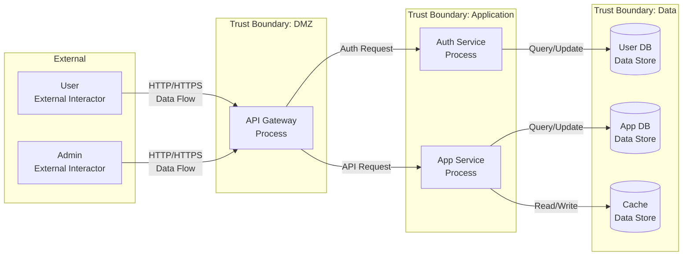
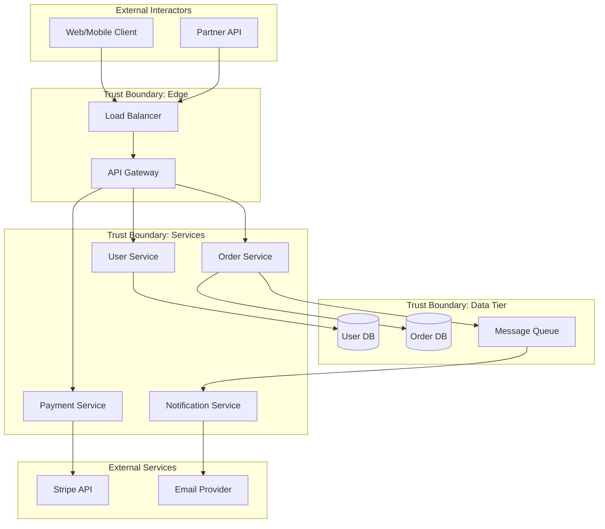
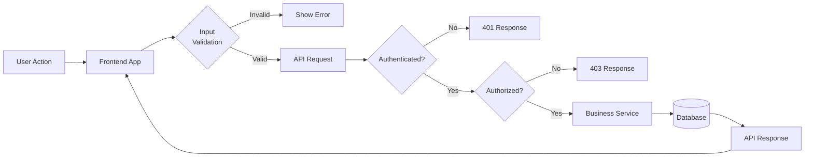
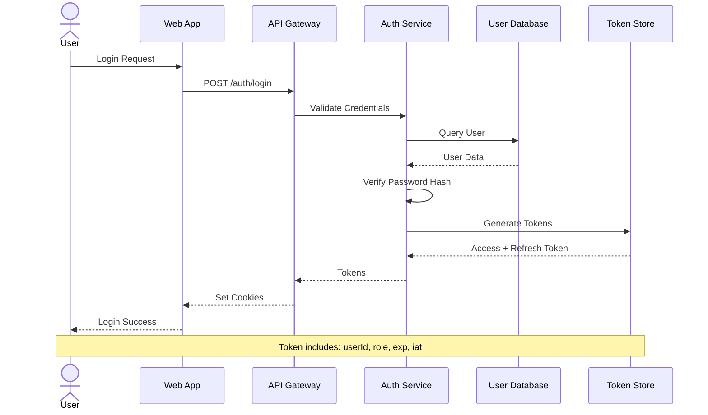
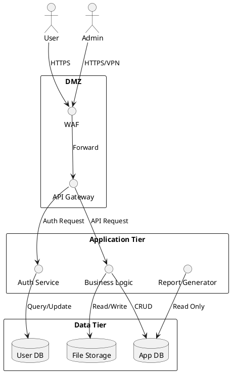

<!-- Code-First Deep Threat Modeling Workflow | Version 2.1.0 | https://github.com/fr33d3m0n/skill-threat-modeling | License: BSD-3-Clause | Welcome to cite but please retain all sources and declarations -->

# Data Flow Diagram Templates for STRIDE Threat Modeling

Source: Adapted from architecture-diagrams skill

## Mermaid DFD Templates

### Template 1: Basic Web Application DFD



### Template 2: Microservices Architecture DFD



### Template 3: Data Flow with Security Controls



### Template 4: Authentication Flow DFD



## PlantUML DFD Templates

### Template 5: Component-Level DFD



## STRIDE Annotation Conventions

When annotating DFD for STRIDE analysis:

### Color Coding
- **Red**: High-risk data flows (PII, credentials)
- **Orange**: Medium-risk (business data)
- **Blue**: Low-risk (public data)

### Element Labeling Format
```
[ElementType] ElementName
Properties:
- authenticates: true/false
- encrypts: true/false
- validates_input: true/false
```

### Trust Boundary Types
1. **Network**: Internet/DMZ/Internal
2. **Process**: Container/VM/Host
3. **User**: Anonymous/Authenticated/Admin

### Data Flow Annotations
```
Source --> Target : Protocol/Encryption
                    Data: [SensitivityLevel]
```

## Threat ID Format

Pattern: `T-{STRIDE}-{ElementID}-{Sequence}`

Examples:
- `T-S-GW-001`: Spoofing threat on Gateway #1
- `T-T-DF1-002`: Tampering threat on DataFlow #2
- `T-I-DS1-001`: Information Disclosure on DataStore #1
