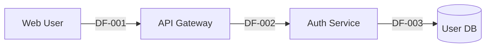

# Phase 2: Call Flow & DFD Analysis

**Type**: Constructive
**Executor**: LLM
**Knowledge**: Security Principles, security-design.yaml

---

## Input Context

← P1: `project_context` {project_type, modules[], entry_points[], security_design{}}

## Output Context

→ P3: `dfd_elements` {external_interactors[], processes[], data_stores[], data_flows[], l1_coverage{}}

---

## Core Analysis Goal

Build comprehensive DFD by tracing ALL data paths from EVERY entry point to ALL data stores.

**"Complete" means 100% L1 coverage**:
- ❌ WRONG: "Analyze key business flows"
- ❌ WRONG: "Focus on critical paths"
- ✅ CORRECT: Analyze EVERY entry point from P1's inventory
- ✅ CORRECT: Trace ALL router modules, not just auth/chat

---

## Knowledge Reference

**Security Principles**:
- Complete Mediation (CM): Identify access checkpoints
- Input Validation (IV): Mark validation points

**Security Domains**: Reference `security-design.yaml` for security-relevant elements

---

## DFD Element Requirements

### External Interactors (EI-xxx)

```yaml
external_interactors:
  - id: EI-001
    name: "Web User"
    type: Human|InternalService|ExternalSystem
    interacts_with: [EP-API-*, EP-UI-*]
```

### Processes (P-xxx)

```yaml
processes:
  - id: P-001
    name: "API Gateway"
    maps_to_module: M-api     # Link to P1 module
    auth_required: true
    entry_points: [EP-API-*]
```

### Data Stores (DS-xxx)

```yaml
data_stores:
  - id: DS-001
    name: "User Database"
    type: PostgreSQL|MongoDB|Redis|...
    sensitivity: HIGH|MEDIUM|LOW
    stores: ["User PII", "Password Hashes"]
    encryption:
      at_rest: true
      in_transit: true
```

### Data Flows (DF-xxx)

```yaml
data_flows:
  - id: DF-001
    from: EI-001
    to: P-001
    data: "User Request"
    protocol: HTTPS|gRPC|TCP|...
    encrypted: true
    entry_points: [EP-API-001, EP-API-002]
```

---

## Required Output Blocks

**Block 1**: `yaml:dfd_elements`

```yaml:dfd_elements
external_interactors:
  - id: EI-001
    name: "Web User"
    type: Human
    interacts_with: [EP-API-*, EP-UI-*]
  - id: EI-002
    name: "Admin User"
    type: Human
    interacts_with: [EP-API-ADMIN-*]
  - id: EI-003
    name: "External LLM API"
    type: ExternalSystem
    interacts_with: [P-005]

processes:
  - id: P-001
    name: "API Gateway"
    maps_to_module: M-api
    auth_required: true
    entry_points: [EP-API-*]
  - id: P-002
    name: "Auth Service"
    maps_to_module: M-auth
    auth_required: false
    entry_points: [EP-API-001, EP-API-002]

data_stores:
  - id: DS-001
    name: "User Database"
    type: PostgreSQL
    sensitivity: HIGH
    stores: ["User PII", "Password Hashes"]
    encryption:
      at_rest: true
      in_transit: true
  - id: DS-002
    name: "Session Cache"
    type: Redis
    sensitivity: HIGH
    encryption:
      at_rest: false
      in_transit: true
```

**Block 2**: `yaml:data_flows` (with l1_coverage)

```yaml:data_flows
flows:
  - id: DF-001
    from: EI-001
    to: P-001
    data: "User Request"
    protocol: HTTPS
    encrypted: true
    entry_points: [EP-API-001, EP-API-002]
  - id: DF-002
    from: P-001
    to: P-002
    data: "Auth Request"
    protocol: Internal
    encrypted: true
  - id: DF-003
    from: P-002
    to: DS-001
    data: "User Lookup"
    protocol: PostgreSQL
    encrypted: true

l1_coverage:
  total_entry_points: 72      # MUST match P1 total
  analyzed: 72                # MUST equal total
  coverage_percentage: 100    # MUST be 100
  entry_point_analysis:
    EP-API-001:
      analyzed: true
      data_flow_traced: true
      security_checkpoints: 4
      related_flows: [DF-001, DF-002]
    EP-API-002:
      analyzed: true
      data_flow_traced: true
      security_checkpoints: 3
      related_flows: [DF-001, DF-003]
    # ... ALL entry points from P1
```

---

## DFD Diagram Requirements

Include both ASCII and Mermaid diagrams:

### ASCII DFD (in report body)

```
┌─────────────────────────────────────────────────────────────────┐
│                          DFD Level 1                             │
├─────────────────────────────────────────────────────────────────┤
│                                                                  │
│  ┌─────────┐        ┌─────────┐        ┌─────────┐             │
│  │ EI-001  │───────▶│  P-001  │───────▶│  P-002  │             │
│  │Web User │ DF-001 │API Gate │ DF-002 │Auth Svc │             │
│  └─────────┘        └─────────┘        └────┬────┘             │
│                                              │                   │
│                                              │ DF-003            │
│                                              ▼                   │
│                                        ┌─────────┐              │
│                                        │ DS-001  │              │
│                                        │User DB  │              │
│                                        └─────────┘              │
└─────────────────────────────────────────────────────────────────┘
```

### Mermaid DFD (in appendix)



---

## Analysis Checklist

1. **For EVERY P1 entry point**:
   - Trace data flow path
   - Identify all processes involved
   - Identify data stores accessed
   - Mark encryption status

2. **For EVERY data store**:
   - Identify sensitivity level
   - Check encryption at rest/transit
   - List data types stored

3. **For EVERY external interactor**:
   - Identify interaction points
   - Mark authentication requirements

---

## Validation Gates

**L1 Coverage MUST be 100%**

| Check | Severity |
|-------|----------|
| l1_coverage.coverage_percentage == 100 | BLOCKING |
| All entry points have analyzed: true | BLOCKING |
| Entry points without data_flow_traced | WARNING |

**If L1 coverage < 100%**:
1. Identify unanalyzed entry points
2. Supplement analysis
3. Re-run validation

---

## Report Template

```markdown
# P2: Call Flow & DFD Analysis

## DFD Summary

| Element Type | Count |
|--------------|-------|
| External Interactors | N |
| Processes | N |
| Data Stores | N |
| Data Flows | N |

## L1 Coverage Analysis

- Total Entry Points (from P1): N
- Analyzed: N
- Coverage: N%

## DFD Diagram

[ASCII diagram]

## Element Inventory

### External Interactors
[yaml:dfd_elements block]

### Data Flows
[yaml:data_flows block]

## DFD Issues Identified

1. ...
2. ...

## Appendix: Mermaid Source

[Mermaid code block]
```

---

## Completion Checklist

Before marking Phase 2 complete:

- [ ] yaml:dfd_elements present with all element types
- [ ] yaml:data_flows present with l1_coverage
- [ ] l1_coverage.coverage_percentage == 100
- [ ] All P1 entry points analyzed
- [ ] ASCII and Mermaid diagrams included
- [ ] Validation passed

---

**End of Phase 2 Instructions** (~250 lines, ~2K tokens)
